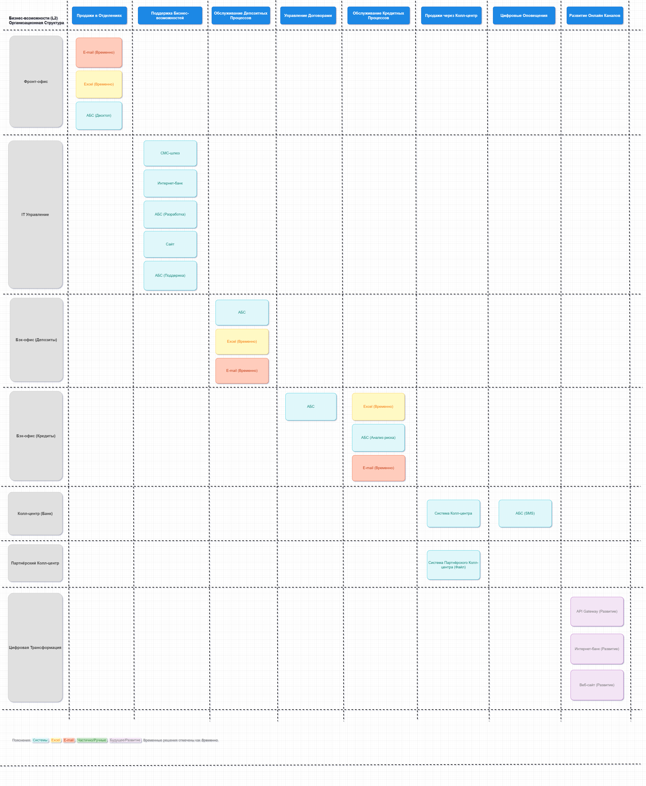
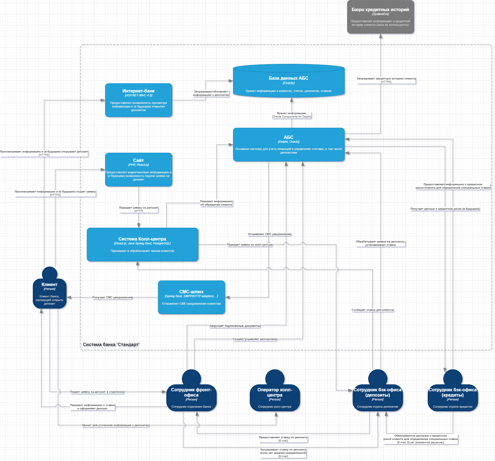

## Задание 1. Карта IT-ландшафта и схема интеграции приложений

▌1.1 Карта IT-ландшафта "Стандарт"

В данном разделе представлен IT-ландшафт банка "Стандарт", описывающий, какие системы используются каждым подразделением для реализации ключевых бизнес-возможностей. Это поможет визуализировать текущую ситуацию и выявить, где необходимо внедрить изменения для цифровой трансформации процесса открытия депозитов.

Ссылка на схему Drawio: [Карта IT-ландшафта "Стандарт" (Диграмма draw.io)](IT.drawio)

Управление обслуживанием в сети отделений (Фронт-офис):

•  Продажи в сети отделений:
  •  АБС (Автоматизированная Банковская Система): Основная система для создания и управления депозитами, загрузки документов, просмотра информации о клиентах. Сотрудники фронт-офиса используют десктопный клиент АБС для проведения операций.
  •  Excel (временно): используется сотрудником для получения ставки от менеджеров бэк-офиса, если ставка не определена заранее.
  •  E-mail (временно): используется для связи с сотрудниками бэк-офиса (кредитного отдела) для согласования специальных ставок, если у клиента много денег на счетах.

Управление IT:

•  Поддержка всех бизнес-возможностей:
  •  Интернет-банк: Клиент-серверная система, используемая для онлайн-операций. Сейчас функционал ограничен платежами и открытием текущих счетов. Необходимо расширить для открытия депозитов.
  •  АБС: Поддержка и разработка основной банковской системы, включая интеграцию с другими системами.
  •  Сайт: Маркетинговая информация и (в будущем) подача заявок на депозиты.
  •  СМС-шлюз: Отправка СМС-оповещений клиентам.

Управление обслуживанием депозитных продуктов (Бэк-офис):

•  Обслуживание депозитных процессов:
  •  АБС: Основная система для обработки заявок на депозиты, определение ставок, и учета операций.
  •  Excel: Расчет ставок на основе ставки рефинансирования и уровня кредитного риска банка (временное решение).
  •  E-mail: Получение ставок от кредитного отдела. Обработка заявок от колл-центра.
• Управление договорами:
  •  АБС: Для загрузки документов подписанных клиентами.

Управление обслуживанием кредитных продуктов (Бэк-офис):

•  Обслуживание кредитных процессов:
  •  АБС: Анализ кредитного риска для определения ставок по депозитам для клиентов с большим количеством денег на счетах (временное решение).
  •  E-mail: Передача данных по кредитному риску сотрудникам депозитного отдела (временное решение).
  • Excel: Используется для расчета ставок и анализа рисков (временное решение).

Колл-центр банка "Стандарт":

•  Продажи через колл-центр:
  •  Система колл-центра (платформа подрядчика): Приём звонков, ведение обращений клиентов. Система интегрирована с АБС для передачи заявок.
• Цифровые оповещения клиентов:
  •  АБС: Отправляет СМС оповещения клиенту о возможности получить депозит.

Партнёрский колл-центр:

•  Продажи через колл-центр:
  •  Система партнёрского колл-центра: Приём звонков (работа по скриптам). Прямая интеграция с системами банка отсутствует.

Команда цифровой трансформации розничного бизнеса:

•  Ответственность за все бизнес-возможности:
  •  Работает над развитием всех онлайн каналов (сайт, интернет-банк)

Пояснения:

•  Временные решения (Excel, E-mail): Эти инструменты используются для ручных расчетов и обмена данными, что является неэффективным и увеличивает время обработки заявок. Необходимо автоматизировать эти процессы.
•  АБС: Центральная система, с которой интегрированы большинство процессов, но прямая интеграция с интернет-банком ограничена.
•  Разделение доступа: Ограничения по доступу к данным между кредитными и депозитными отделами усложняют процесс согласования ставок.

▌1.2 Схема интеграции приложений "Стандарт" (Контекстная диаграмма C4)

Ссылка на схему Drawio: [Схема интеграции приложений "Стандарт" (Контекстная диаграмма C4)](Integration.drawio)

Пояснения к схеме:

•  Клиент: Получает информацию о депозитах через веб-сайт и (в будущем) подает заявку онлайн. Использует интернет-банк для управления счетами и (в перспективе) для открытия депозитов. В текущей реализации (AS IS) подает заявку на депозит лично в отделении и может звонить в колл-центр для уточнения деталей.
•  Веб-сайт: Предоставляет маркетинговую информацию и (в будущем TO BE) позволяет подать заявку на депозит, которая в текущей реализации (AS IS) передается в систему колл-центра.
•  Интернет-банк: Взаимодействует с базой данных АБС для получения информации о счетах. В целевой архитектуре (TO BE) должен автоматически открывать депозиты через API АБС.
•  АБС (Автоматизированная Банковская Система): Центральная система для учета операций, включая депозиты. Взаимодействует с системой колл-центра (AS IS) для обработки заявок. Отправляет SMS-уведомления клиентам через SMS-шлюз. В целевой архитектуре (TO BE) предоставляет API для автоматического открытия депозитов.
•  Система Колл-центра: Получает заявки на депозиты с веб-сайта (AS IS) и передает информацию в АБС. Используется операторами колл-центра для обработки звонков клиентов, уточняющих информацию о депозитах (AS IS).
•  Сотрудник Фронт-офиса: В текущей реализации (AS IS) создает и управляет депозитами в АБС, а также взаимодействует с сотрудниками бэк-офиса для получения ставок по депозитам.
•  Сотрудник Бэк-офиса (Депозиты): В текущей реализации (AS IS) обрабатывает заявки на депозиты, устанавливает ставки и обменивается информацией с сотрудниками отдела кредитования через E-mail и Excel.
•  Сотрудник Бэк-офиса (Кредиты): Предоставляет информацию о кредитном риске клиента, необходимую для расчета специальных ставок по депозитам, сотрудникам бэк-офиса (AS IS). В целевой архитектуре (TO BE) эта информация должна быть доступна через API АБС.
•  E-mail, Excel: Указывают на ручной процесс обмена данными между сотрудниками бэк-офиса, который необходимо автоматизировать.
•  SMS-шлюз: Используется АБС для отправки SMS-уведомлений клиентам.
•  Бюро кредитных историй: В текущей реализации (AS IS) не используется в процессе открытия депозитов, но может быть интегрировано в будущем.

Дальнейшие шаги для цифровой трансформации:

•  Автоматизация расчета ставок: Создать API в АБС для автоматического расчета ставок по депозитам на основе ставки рефинансирования и кредитного риска.
•  Автоматизация взаимодействия между отделами: Заменить ручной обмен данными между отделами кредитования и депозитов (E-mail, Excel) на автоматизированное взаимодействие через API АБС.
•  Безопасный API для Интернет-банка: Разработать безопасный API для взаимодействия интернет-банка с АБС, исключив прямой доступ к базе данных.
•  Расширение функциональности Интернет-банка: Реализовать возможность автоматического открытия депозитов в интернет-банке с использованием API АБС.
•  Улучшение интеграции системы Колл-центра с АБС: Обеспечить более эффективную передачу заявок и информации между колл-центром и АБС, возможно, через API.
•  (Будущее) Интеграция с Бюро Кредитных Историй: Подключить АБС к Бюро Кредитных Историй для получения информации о кредитной истории клиента (если необходимо).

Эти шаги направлены на автоматизацию процесса открытия депозитов, сокращение ручного труда, повышение эффективности взаимодействия между системами и отделами, улучшение клиентского опыта и снижение операционных издержек.