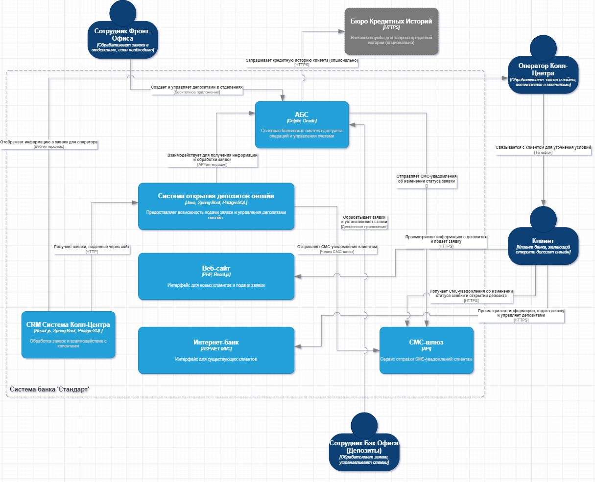
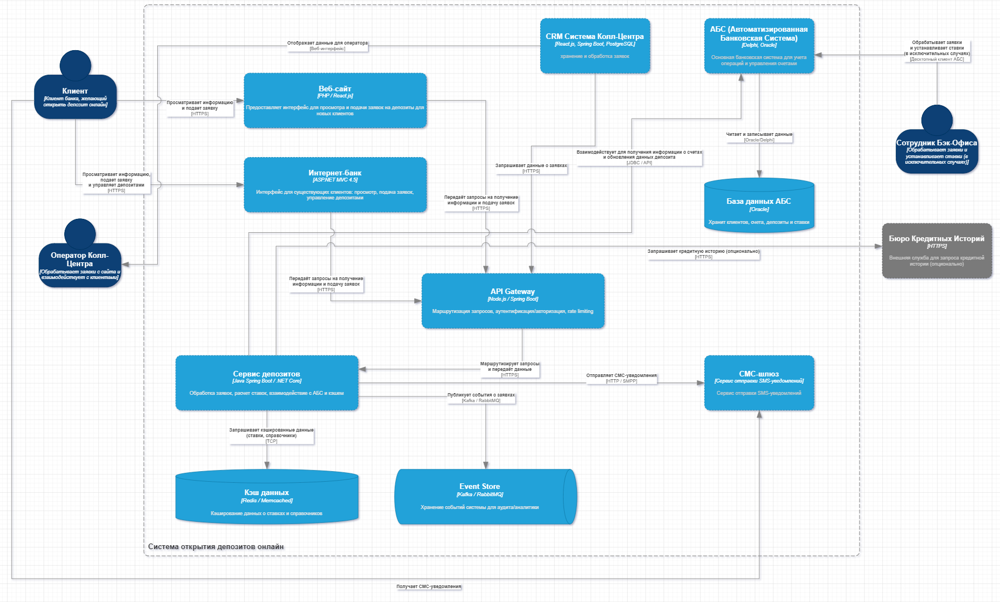

### Название задачи: <a name="_b7urdng99y53">Задание 3. Открытие депозитов онлайн</a>  

### Автор: <a name="_hjk0fkfyohdk">Michael Netesunny</a>

### Дата: <a name="_uanumrh8zrui">2025-08-08</a>

### <a name="_3bfxc9a45514">Функциональные требования</a>

#### Контекст  

Банк "Стандарт" стремится к цифровой трансформации, чтобы привлечь более молодых клиентов и увеличить прибыль. Основная задача – предоставить возможность открытия депозитов и накопительных счетов онлайн через веб-сайт (для новых клиентов) и интернет-банк (для существующих). На текущем этапе (MVP) предполагается реализация базового функционала с возможностью подачи заявки онлайн и ручной обработкой в бэк-офисе.  

#### Цели  

•  Предоставить клиентам возможность подать заявку на открытие депозита онлайн.  
•  Автоматизировать часть процесса открытия депозита.  
•  Сократить время обработки заявок на депозиты.  
•  Сохранить совместимость с существующими банковскими системами.  
•  Снизить операционные издержки на открытие новых депозитов (в перспективе).  

|**№**|**Действующие лица или системы**|**Use Case**|**Описание**|
|:---:	| :------------------------------------------| :-----------------------------------------------------------------------------| :--------------------------------------------------------------------------------------------------------------------------------------------------|
| 	1	| Клиент 													| Подача заявки на депозит через сайт 													| Клиент посещает сайт, выбирает депозит, заполняет форму с ФИО и номером телефона и отправляет заявку. 								|
| 	  	| 																| 																													|   																																																					|
| 	  	| 																| 																													| •  ID: UC-SITE-001																																															|
| 	  	| 																| 																													| •  Название: Подача заявки на депозит через сайт																																	|
| 	  	| 																| 																													| •  Участник: Клиент																																														|
| 	  	| 																| 																													| •  Заинтересованные стороны:																																									|
| 	  	| 																| 																													|   •  Банк: Получение новых потенциальных клиентов.																																|
| 	  	| 																| 																													|   •  Отдел маркетинга: Оценка эффективности рекламных кампаний.																									|
| 	  	| 																| 																													|   •  Колл-центр: Получение и обработка заявок.																																		|
| 	  	| 																| 																													| •  Предусловия:																																															|
| 	  	| 																| 																													|   •  Клиент имеет доступ к интернету.																																						|
| 	  	| 																| 																													|   •  Клиент знает адрес сайта банка.																																							|
| 	  	| 																| 																													|   •  На сайте размещена актуальная информация о депозитах.																												|
| 	  	| 																| 																													| •  Основной сценарий:																																												|
| 	  	| 																| 																													|   1. Клиент посещает сайт банка.																																								|
| 	  	| 																| 																													|   2. Клиент переходит на страницу с информацией о депозитах.																											|
| 	  	| 																| 																													|   3. Клиент изучает доступные депозитные продукты и их условия.																										|
| 	  	| 																| 																													|   4. Клиент выбирает интересующий его депозит.																																	|
| 	  	| 																| 																													|   5. Клиент нажимает кнопку "Подать заявку".																																			|
| 	  	| 																| 																													|   6. Клиент заполняет форму заявки, указывая:																																		|
| 	  	| 																| 																													|     *  ФИО																																																		|
| 	  	| 																| 																													|     *  Номер телефона																																													|
| 	  	| 																| 																													|   7. Клиент принимает условия обработки персональных данных (чекбокс).																						|
| 	  	| 																| 																													|   8. Клиент отправляет заявку.																																									|
| 	  	| 																| 																													|   9. Система отображает сообщение об успешной отправке заявки.																										|
| 	  	| 																| 																													| •  Альтернативные сценарии:																																										|
| 	  	| 																| 																													|   •  UC-SITE-001-A: Некорректный ввод данных:																																		|
| 	  	| 																| 																													|     1. На шаге 6 Клиент вводит некорректные данные (например, неверный формат номера телефона).											|
| 	  	| 																| 																													|     2. Система отображает сообщение об ошибке с указанием некорректного поля.																			|
| 	  	| 																| 																													|     3. Клиент исправляет ошибки и повторяет шаги 7-9.																															|
| 	  	| 																| 																													|   •  UC-SITE-001-B: Ошибка сервера:																																							|
| 	  	| 																| 																													|     1. На шаге 9 происходит ошибка при отправке данных на сервер.																									|
| 	  	| 																| 																													|     2. Система отображает сообщение об ошибке и предлагает попробовать позже.																			|
| 	  	| 																| 																													| •  Постусловия:																																															|
| 	  	| 																| 																													|   •  Заявка на депозит сохранена в системе колл-центра.																														|
| 	  	| 																| 																													|   •  Клиент видит подтверждение успешной отправки заявки.																												|
| 	  	| 																| 																													|   																																																					|
|	2	| Клиент													| Подача заявки на депозит через интернет-банк 									| Клиент авторизуется в интернет-банке, выбирает депозит, указывает счёт и сумму, подтверждает заявку СМС-кодом. 				|
| 	  	| 																| 																													|   																																																					|
| 	  	| 																| 																													| •  ID: UC-IBANK-001																																														|
| 	  	| 																| 																													| •  Название: Подача заявки на депозит через интернет-банк																												|
| 	  	| 																| 																													| •  Участник: Клиент (зарегистрированный пользователь интернет-банка)																							|
| 	  	| 																| 																													| •  Заинтересованные стороны:																																									|
| 	  	| 																| 																													|   •  Банк: Увеличение продаж депозитных продуктов.																																|
| 	  	| 																| 																													|   •  IT-отдел: Обеспечение работоспособности интернет-банка.																											|
| 	  	| 																| 																													|   •  Отдел безопасности: Обеспечение безопасности операций.																											|
| 	  	| 																| 																													| •  Предусловия:																																															|
| 	  	| 																| 																													|   •  Клиент зарегистрирован в интернет-банке и имеет логин/пароль.																									|
| 	  	| 																| 																													|   •  Клиент имеет доступ к интернету.																																						|
| 	  	| 																| 																													|   •  Клиент имеет банковский счёт в данном банке.																																	|
| 	  	| 																| 																													|   •  На счёте достаточно средств для открытия депозита.																														|
| 	  	| 																| 																													|   •  В интернет-банке размещена актуальная информация о депозитах.																								|
| 	  	| 																| 																													| •  Основной сценарий:																																												|
| 	  	| 																| 																													|   1. Клиент открывает страницу интернет-банка.																																		|
| 	  	| 																| 																													|   2. Клиент вводит логин и пароль и проходит аутентификацию.																											|
| 	  	| 																| 																													|   3. Клиент переходит в раздел "Депозиты".																																				|
| 	  	| 																| 																													|   4. Клиент изучает доступные депозитные продукты и их условия.																										|
| 	  	| 																| 																													|   5. Клиент выбирает интересующий его депозит.																																	|
| 	  	| 																| 																													|   6. Клиент нажимает кнопку "Открыть депозит".																																		|
| 	  	| 																| 																													|   7. Клиент выбирает счёт, с которого будет списана сумма депозита.																									|
| 	  	| 																| 																													|   8. Клиент указывает сумму депозита.																																						|
| 	  	| 																| 																													|   9. Клиент подтверждает согласие с условиями договора (чекбокс).																									|
| 	  	| 																| 																													|   10. Система генерирует СМС-код и отправляет его на номер телефона клиента.																				|
| 	  	| 																| 																													|   11. Клиент вводит полученный СМС-код в соответствующее поле.																										|
| 	  	| 																| 																													|   12. Клиент подтверждает заявку.																																								|
| 	  	| 																| 																													|   13. Система отображает сообщение об успешной подаче заявки на открытие депозита.																|
| 	  	| 																| 																													| •  Альтернативные сценарии:																																										|
| 	  	| 																| 																													|   •  UC-IBANK-001-A: Неверный логин/пароль:																																			|
| 	  	| 																| 																													|     1. На шаге 2 Клиент вводит неверный логин или пароль.																													|
| 	  	| 																| 																													|     2. Система отображает сообщение об ошибке аутентификации.																										|
| 	  	| 																| 																													|     3. Клиент повторяет шаг 2.																																										|
| 	  	| 																| 																													|     4. (После нескольких неудачных попыток, система блокирует аккаунт или предлагает восстановить пароль).							|
| 	  	| 																| 																													|   •  UC-IBANK-001-B: Недостаточно средств на счёте:																																|
| 	  	| 																| 																													|     1. На шаге 8 Клиент указывает сумму депозита, превышающую остаток насчёте.																			|
| 	  	| 																| 																													|     2. Система отображает сообщение о недостаточности средств на счёте.																							|
| 	  	| 																| 																													|     3. Клиент изменяет сумму депозита или выбирает другой счёт.																											|
| 	  	| 																| 																													|   •  UC-IBANK-001-C: Неверный СМС-код:																																					|
| 	  	| 																| 																													|     1. На шаге 11 Клиент вводит неверный СМС-код.																																|
| 	  	| 																| 																													|     2. Система отображает сообщение о неверном СМС-коде.																												|
| 	  	| 																| 																													|     3. Клиент повторяет шаг 11.																																									|
| 	  	| 																| 																													|     4. (После нескольких неудачных попыток, система аннулирует заявку или предлагает запросить новый СМС-код).					|
| 	  	| 																| 																													|   •  UC-IBANK-001-D: Техническая ошибка при отправке СМС:																												|
| 	  	| 																| 																													|     1. На шаге 10 происходит ошибка при отправке СМС.																														|
| 	  	| 																| 																													|     2. Система отображает сообщение об ошибке и предлагает повторить запрос СМС-кода.															|
| 	  	| 																| 																													| •  Постусловия:																																															|
| 	  	| 																| 																													|   •  Заявка на депозит сохранена в системе банка.																																	|
| 	  	| 																| 																													|   •  Клиент видит подтверждение успешной подачи заявки.																													|
| 	  	| 																| 																													| 																																																						|
|	3	| Система колл-центра 							| Получение заявки на депозит с сайта 													| Система колл-центра получает заявку, предоставляет менеджеру информацию о клиенте. 																|
| 	  	| 																| 																													|   																																																					|
| 	  	| 																| 																													| •  ID: UC-CALLCENTER-001																																											|
| 	  	| 																| 																													| •  Название: Получение заявки на депозит с сайта																																	|
| 	  	| 																| 																													| •  Участник: Система колл-центра																																								|
| 	  	| 																| 																													| •  Заинтересованные стороны:																																									|
| 	  	| 																| 																													|   •  Колл-центр: Организация работы с потенциальными клиентами.																									|
| 	  	| 																| 																													|   •  IT-отдел: Обеспечение интеграции между сайтом и системой колл-центра.																					|
| 	  	| 																| 																													|   •  Отдел маркетинга: Оценка эффективности лидогенерации.																												|
| 	  	| 																| 																													| •  Предусловия:																																															|
| 	  	| 																| 																													|   •  Работающая система колл-центра.																																						|
| 	  	| 																| 																													|   •  Интеграция между сайтом банка и системой колл-центра.																												|
| 	  	| 																| 																													|   •  Настроены каналы связи для приема заявок с сайта.																														|
| 	  	| 																| 																													| •  Основной сценарий:																																												|
| 	  	| 																| 																													|   1. С сайта поступает новая заявка на открытие депозита.																														|
| 	  	| 																| 																													|   2. Система колл-центра получает данные заявки:																																	|
| 	  	| 																| 																													|     *  ФИО клиента																																														|
| 	  	| 																| 																													|     *  Номер телефона клиента																																									|
| 	  	| 																| 																													|     *  Тип выбранного депозита (если применимо)																																	|
| 	  	| 																| 																													|     *  Дата и время подачи заявки																																								|
| 	  	| 																| 																													|   3. Система колл-центра автоматически создаёт новую карточку клиента или обновляет существующую.										|
| 	  	| 																| 																													|   4. Заявка отображается в интерфейсе менеджера колл-центра, доступного для обработки.															|
| 	  	| 																| 																													| •  Альтернативные сценарии:																																										|
| 	  	| 																| 																													|   •  UC-CALLCENTER-001-A: Ошибка интеграции:																																		|
| 	  	| 																| 																													|     1. При передаче заявки возникает ошибка интеграции между сайтом и системой колл-центра.													|
| 	  	| 																| 																													|     2. Заявка не поступает в систему колл-центра.																																	|
| 	  	| 																| 																													|     3. Система уведомляет администратора об ошибке.																															|
| 	  	| 																| 																													|   •  UC-CALLCENTER-001-B: Некорректные данные заявки:																														|
| 	  	| 																| 																													|     1. С сайта поступает заявка с некорректными данными (например, пустые поля).																			|
| 	  	| 																| 																													|     2. Система колл-центра регистрирует ошибку и отклоняет заявку.																									|
| 	  	| 																| 																													| •  Постусловия:																																															|
| 	  	| 																| 																													|   •  Заявка на депозит отображается в системе колл-центра и доступна для обработки менеджером.												|
| 	  	| 																| 																													| 																																																						|
|	4	| Менеджер колл-центра 						| Связь с клиентом и предложение особых условий (с сайта) 				| Менеджер колл-центра связывается с клиентом, обсуждает условия депозита и может предложить индивидуальные условия. 	|
| 	  	| 																| 																													|   																																																					|
| 	  	| 																| 																													| •  ID: UC-CALLCENTER-002																																											|
| 	  	| 																| 																													| •  Название: Связь с клиентом и предложение особых условий (с сайта)																								|
| 	  	| 																| 																													| •  Участник: Менеджер колл-центра																																							|
| 	  	| 																| 																													| •  Заинтересованные стороны:																																									|
| 	  	| 																| 																													|   •  Банк: Увеличение продаж депозитных продуктов.																																|
| 	  	| 																| 																													|   •  Колл-центр: Выполнение плана продаж.																																				|
| 	  	| 																| 																													|   •  Клиент: Получение выгодных условий по депозиту.																															|
| 	  	| 																| 																													| •  Предусловия:																																															|
| 	  	| 																| 																													|   •  Менеджер колл-центра имеет доступ к системе колл-центра.																											|
| 	  	| 																| 																													|   •  В системе колл-центра есть заявка на депозит от клиента.																												|
| 	  	| 																| 																													|   •  Менеджер имеет необходимые скрипты и информацию о депозитных продуктах.																		|
| 	  	| 																| 																													|   •  Менеджер имеет полномочия предлагать особые условия.																												|
| 	  	| 																| 																													| •  Основной сценарий:																																												|
| 	  	| 																| 																													|   1. Менеджер колл-центра открывает заявку на депозит в системе колл-центра.																				|
| 	  	| 																| 																													|   2. Менеджер просматривает информацию о клиенте (ФИО, номер телефона, выбранный депозит).												|
| 	  	| 																| 																													|   3. Менеджер связывается с клиентом по телефону.																																|
| 	  	| 																| 																													|   4. Менеджер приветствует клиента и представляется.																															|
| 	  	| 																| 																													|   5. Менеджер уточняет информацию о заявке и потребностях клиента.																								|
| 	  	| 																| 																													|   6. Менеджер предоставляет подробную информацию о выбранном депозите.																				|
| 	  	| 																| 																													|   7. Менеджер предлагает особые условия, если это возможно и целесообразно 																				|
| 	  	| 																| 																													|   (например, повышенную процентную ставку).																																		|
| 	  	| 																| 																													|   8. Клиент принимает или отклоняет предложение менеджера.																											|
| 	  	| 																| 																													|   9. Менеджер фиксирует результат разговора в системе колл-центра (согласие/отказ, комментарии).											|
| 	  	| 																| 																													|   10. Менеджер информирует клиента о дальнейших шагах (например, посещение отделения для оформления депозита).			|
| 	  	| 																| 																													| •  Альтернативные сценарии:																																										|
| 	  	| 																| 																													|   •  UC-CALLCENTER-002-A: Клиент не отвечает на звонок:																														|
| 	  	| 																| 																													|     1. На шаге 3 менеджер не может связаться с клиентом.																														|
| 	  	| 																| 																													|     2. Менеджер делает повторную попытку связи позже.																														|
| 	  	| 																| 																													|     3. (Если после нескольких попыток клиент не отвечает, заявка закрывается или передается другому менеджеру).					|
| 	  	| 																| 																													|   •  UC-CALLCENTER-002-B: Клиент отказывается от предложения:																											|
| 	  	| 																| 																													|     1. На шаге 8 клиент отказывается от предложения менеджера.																											|
| 	  	| 																| 																													|     2. Менеджер пытается выяснить причины отказа и предложить альтернативные варианты.															|
| 	  	| 																| 																													|     3. (Если клиент остается непреклонен, менеджер завершает разговор и фиксирует отказ в системе).											|
| 	  	| 																| 																													|   •  UC-CALLCENTER-002-C: Менеджер не может предложить особые условия:																					|
| 	  	| 																| 																													|     1. На шаге 7 менеджер не имеет возможности предложить особые условия 																					|
| 	  	| 																| 																													|     (например, из-за ограничений по полномочиям или по условиям депозита). 																				|
| 	  	| 																| 																													|     2. Менеджер информирует клиента о стандартных условиях депозита.																							|
| 	  	| 																| 																													| •  Постусловия:																																															|
| 	  	| 																| 																													|   •  Результат разговора с клиентом зафиксирован в системе колл-центра.																							|
| 	  	| 																| 																													|   •  Клиент проинформирован о дальнейших шагах по открытию депозита.																						|
| 	  	| 																| 																													|   •  (Если клиент согласился на открытие депозита, информация передается в соответствующие отделы банка).							|
| 	  	| 																| 																													| 																																																						|
|	5	| АБС 														| Получение заявки на депозит с интернет-банка/колл-центра 			| АБС получает информацию о заявке, предоставленную либо через систему колл-центра (заявка с сайта), либо напрямую			|
| 	  	| 																| 																													| из интернет-банка.																																														|
| 	  	| 																| 																													|   																																																					|
| 	  	| 																| 																													| •  ID: UC-ABS-001																																															|
| 	  	| 																| 																													| •  Название: Получение заявки на депозит																																				|
| 	  	| 																| 																													| •  Участник: АБС (Автоматизированная Банковская Система)																													|
| 	  	| 																| 																													| •  Заинтересованные стороны:																																									|
| 	  	| 																| 																													|   •  Банк: Централизация информации о клиентах и продуктах.																												|
| 	  	| 																| 																													|   •  Бэк-офис (Депозиты): Обработка заявок и открытие депозитов.																										|
| 	  	| 																| 																													|   •  IT-отдел: Поддержка интеграции между системами.																															|
| 	  	| 																| 																													| •  Предусловия:																																															|
| 	  	| 																| 																													|   •  Работающая АБС.																																													|
| 	  	| 																| 																													|   •  Настроена интеграция АБС с интернет-банком и/или системой колл-центра.																				|
| 	  	| 																| 																													|   •  Определены форматы данных для передачи заявок.																															|
| 	  	| 																| 																													| •  Основной сценарий (с Интернет-Банка):																																				|
| 	  	| 																| 																													|   1. Интернет-банк отправляет в АБС данные о заявке на депозит.																										|
| 	  	| 																| 																													|   2. АБС получает данные заявки:																																								|
| 	  	| 																| 																													|     *  ID клиента (в системе АБС)																																								|
| 	  	| 																| 																													|     *  Тип депозита																																														|
| 	  	| 																| 																													|     *  Сумма депозита																																													|
| 	  	| 																| 																													|     *  Счёт списания																																														|
| 	  	| 																| 																													|     *  Дата и время подачи заявки																																								|
| 	  	| 																| 																													|     *  ID заявки (уникальный идентификатор)																																			|
| 	  	| 																| 																													|   3. АБС проверяет формат данных заявки.																																				|
| 	  	| 																| 																													|   4. АБС создает новую запись о заявке на депозит в соответствующей базе данных.																			|
| 	  	| 																| 																													| •  Основной сценарий (с Колл-Центра):																																					|
| 	  	| 																| 																													|   1. Система колл-центра отправляет в АБС данные о заявке на депозит.																								|
| 	  	| 																| 																													|   2. АБС получает данные заявки:																																								|
| 	  	| 																| 																													|     *  ФИО клиента																																														|
| 	  	| 																| 																													|     *  Номер телефона клиента																																									|
| 	  	| 																| 																													|     *  Тип депозита																																														|
| 	  	| 																| 																													|     *  (Возможно) Предложенные особые условия																																		|
| 	  	| 																| 																													|     *  Дата и время подачи заявки																																								|
| 	  	| 																| 																													|     *  ID заявки (уникальный идентификатор)																																			|
| 	  	| 																| 																													|   3. АБС проверяет формат данных заявки.																																				|
| 	  	| 																| 																													|   4. АБС проверяет, существует ли клиент в системе.																																|
| 	  	| 																| 																													|     *  Если клиент существует: обновляет данные клиента (при необходимости).																			|
| 	  	| 																| 																													|     *  Если клиент не существует: создает нового клиента.																													|
| 	  	| 																| 																													|   5. АБС создает новую запись о заявке на депозит в соответствующей базе данных.																			|
| 	  	| 																| 																													| •  Альтернативные сценарии:																																										|
| 	  	| 																| 																													|   •  UC-ABS-001-A: Ошибка интеграции:																																					|
| 	  	| 																| 																													|     1. При передаче заявки возникает ошибка интеграции.																														|
| 	  	| 																| 																													|     2. АБС не получает данные заявки.																																						|
| 	  	| 																| 																													|     3. АБС возвращает сообщение об ошибке в систему-источник.																										|
| 	  	| 																| 																													|   •  UC-ABS-001-B: Некорректные данные заявки:																																	|
| 	  	| 																| 																													|     1. Система передает заявку с некорректными данными (например, неверный формат ID клиента).												|
| 	  	| 																| 																													|     2. АБС отклоняет заявку и возвращает сообщение об ошибке.																											|
| 	  	| 																| 																													|   •  UC-ABS-001-C: Дублирующаяся заявка:																																				|
| 	  	| 																| 																													|     1. АБС получает заявку с ID, который уже существует в системе.																										|
| 	  	| 																| 																													|     2. АБС проверяет статус существующей заявки.																																	|
| 	  	| 																| 																													|     3. (Если существующая заявка находится в статусе "Обрабатывается" или "Открыт", АБС отклоняет новую заявку. 					|
| 	  	| 																| 																													|     В противном случае, АБС обрабатывает новую заявку, возможно, с уведомлением администратора).										|
| 	  	| 																| 																													| •  Постусловия:																																															|
| 	  	| 																| 																													|   •  Заявка на депозит сохранена в АБС и доступна для обработки сотрудником бэк-офиса.																|
| 	  	| 																| 																													| 																																																						|
|	6	| Сотрудник бэк-офиса (депозиты) 		| Обработка заявки на депозит в АБС 														| Сотрудник бэк-офиса обрабатывает заявку, проверяет данные, устанавливает ставку. 																		|
| 	  	| 																| 																													|   																																																					|
| 	  	| 																| 																													| •  ID: UC-ABS-002																																															|
| 	  	| 																| 																													| •  Название: Обработка заявки на депозит																																				|
| 	  	| 																| 																													| •  Участник: Сотрудник бэк-офиса (депозиты)																																			|
| 	  	| 																| 																													| •  Заинтересованные стороны:																																									|
| 	  	| 																| 																													|   •  Банк: Эффективное управление депозитными продуктами.																												|
| 	  	| 																| 																													|   •  Отдел Комплаенс: Соблюдение нормативных требований.																												|
| 	  	| 																| 																													|   •  Клиент: Своевременное открытие депозита.																																		|
| 	  	| 																| 																													| •  Предусловия:																																															|
| 	  	| 																| 																													|   •  Сотрудник имеет доступ к АБС с соответствующими правами.																										|
| 	  	| 																| 																													|   •  В АБС есть новая заявка на депозит в статусе "Новая".																														|
| 	  	| 																| 																													| •  Основной сценарий:																																												|
| 	  	| 																| 																													|   1. Сотрудник бэк-офиса выбирает в АБС заявку на депозит для обработки.																						|
| 	  	| 																| 																													|   2. Сотрудник просматривает данные заявки:																																			|
| 	  	| 																| 																													|     *  Данные клиента																																													|
| 	  	| 																| 																													|     *  Тип депозита																																														|
| 	  	| 																| 																													|     *  Сумма депозита																																													|
| 	  	| 																| 																													|     *  (Для заявок с Колл-Центра) Предложенные особые условия																											|
| 	  	| 																| 																													|   3. Сотрудник проверяет данные клиента и депозита на соответствие требованиям банка и нормативным актам 						|
| 	  	| 																| 																													|   (например, проверка KYC/AML).																																								|
| 	  	| 																| 																													|   4. Сотрудник устанавливает процентную ставку по депозиту:																												|
| 	  	| 																| 																													|     *  Если заявка пришла из интернет-банка и ставка стандартная: сотрудник подтверждает ставку.									|
| 	  	| 																| 																													|     *  Если заявка пришла из колл-центра с предложенными особыми условиями: сотрудник проверяет обоснованность 			|
| 	  	| 																| 																													|        особых условий (возможно, запрашивая данные у отдела кредитов - Use Case 7) и устанавливает ставку.								|
| 	  	| 																| 																													|     *  Если это заявка с сайта (пока еще ручной процесс): сотрудник вручную определяет ставку, 												|
| 	  	| 																| 																													|        используя доступные инструменты (XLS файлы, внутренние политики).																						|
| 	  	| 																| 																													|   5. Сотрудник сохраняет ставку в АБС.																																						|
| 	  	| 																| 																													|   6. Сотрудник подтверждает заявку на открытие депозита.																													|
| 	  	| 																| 																													|   7. АБС автоматически создает депозитный договор.																																|
| 	  	| 																| 																													|   8. АБС отправляет уведомление клиенту (Use Case 8).																															|
| 	  	| 																| 																													| •  Альтернативные сценарии:																																										|
| 	  	| 																| 																													|   •  UC-ABS-002-A: Заявка отклонена из-за несоответствия требованиям:																								|
| 	  	| 																| 																													|     1. На шаге 3 сотрудник обнаруживает несоответствие требованиям (например, клиент находится в списке санкций).				|
| 	  	| 																| 																													|     2. Сотрудник отклоняет заявку и указывает причину отклонения.																										|
| 	  	| 																| 																													|   •  UC-ABS-002-B: Невозможно определить ставку автоматически:																										|
| 	  	| 																| 																													|     1. На шаге 4 не удается определить ставку автоматически (например, требуется дополнительное согласование).						|
| 	  	| 																| 																													|     2. Сотрудник переводит заявку в статус "Ожидает решения".																											|
| 	  	| 																| 																													|     3. (После получения согласования, сотрудник возвращается к заявке и завершает процесс).														|
| 	  	| 																| 																													|   •  UC-ABS-002-C: Ошибка при создании депозитного договора:																											|
| 	  	| 																| 																													|     1. На шаге 7 возникает ошибка при создании депозитного договора.																								|
| 	  	| 																| 																													|     2. Сотрудник получает уведомление об ошибке и предпринимает действия для ее устранения 													|
| 	  	| 																| 																													|        (например, обращается в IT-отдел).																																					|
| 	  	| 																| 																													| •  Постусловия:																																															|
| 	  	| 																| 																													|   •  Заявка на депозит обработана в АБС.																																					|
| 	  	| 																| 																													|   •  Установлена процентная ставка.																																							|
| 	  	| 																| 																													|   •  Создан депозитный договор (или отклонена заявка с указанием причины).																					|
| 	  	| 																| 																													|   •  Клиенту отправлено уведомление (Use Case 8).																																	|
| 	  	| 																| 																													| 																																																						|
|	7	| Сотрудник бэк-офиса (кредиты) 		| Предоставление данных о кредитном риске (для особых условий) 	| В случае запроса особых условий, сотрудник кредитного отдела предоставляет данные о кредитном риске клиента,  				|
| 	  	| 																| 																													| необходимые для определения индивидуальной ставки.																														|
| 	  	| 																| 																													|   																																																					|
| 	  	| 																| 																													| •  ID: UC-CREDIT-001																																													|
| 	  	| 																| 																													| •  Название: Предоставление данных о кредитном риске																														|
| 	  	| 																| 																													| •  Участник: Сотрудник бэк-офиса (кредиты)																																			|
| 	  	| 																| 																													| •  Заинтересованные стороны:																																									|
| 	  	| 																| 																													|   •  Бэк-офис (Депозиты): Определение индивидуальных ставок для депозитов.																					|
| 	  	| 																| 																													|   •  Банк: Управление кредитным риском.																																					|
| 	  	| 																| 																													|   •  Отдел Комплаенс: Соблюдение нормативных требований.																												|
| 	  	| 																| 																													| •  Предусловия:																																															|
| 	  	| 																| 																													|   •  Сотрудник имеет доступ к АБС с соответствующими правами (в частности, к данным о кредитных рисках).								|
| 	  	| 																| 																													|   •  Получен запрос от сотрудника бэк-офиса (депозиты) на предоставление данных о кредитном риске клиента.						|
| 	  	| 																| 																													| •  Основной сценарий:																																												|
| 	  	| 																| 																													|   1. Сотрудник бэк-офиса (кредиты) получает запрос от сотрудника бэк-офиса (депозиты) с информацией о клиенте.					|
| 	  	| 																| 																													|   2. Сотрудник анализирует кредитную историю клиента в АБС.																											|
| 	  	| 																| 																													|   3. Сотрудник оценивает кредитный риск клиента, используя установленные методики и правила.												|
| 	  	| 																| 																													|   4. Сотрудник формирует отчет с информацией о кредитном риске клиента. В отчет может входить:												|
| 	  	| 																| 																													|     *  Кредитный рейтинг клиента																																							|
| 	  	| 																| 																													|     *  Текущая задолженность клиента																																						|
| 	  	| 																| 																													|     *  История погашения кредитов																																							|
| 	  	| 																| 																													|     *  Наличие просрочек																																												|
| 	  	| 																| 																													|     *  И другая релевантная информация																																					|
| 	  	| 																| 																													|   5. Сотрудник отправляет отчет сотруднику бэк-офиса (депозиты).																										|
| 	  	| 																| 																													| •  Альтернативные сценарии:																																										|
| 	  	| 																| 																													|   •  UC-CREDIT-001-A: Отсутствие кредитной истории клиента:																												|
| 	  	| 																| 																													|     1. На шаге 2 у клиента отсутствует кредитная история.																														|
| 	  	| 																| 																													|     2. Сотрудник использует другие методы оценки кредитного риска (например, анализ косвенных данных).								|
| 	  	| 																| 																													|     3. Сотрудник формирует отчет с указанием отсутствия кредитной истории и результатами оценки на основе других данных.	|
| 	  	| 																| 																													|   •  UC-CREDIT-001-B: Проблемы с доступом к данным:																															|
| 	  	| 																| 																													|     1. На шаге 2 возникают проблемы с доступом к данным кредитной истории клиента.																	|
| 	  	| 																| 																													|     2. Сотрудник обращается в IT-отдел для решения проблемы.																											|
| 	  	| 																| 																													|     3. (После получения доступа, сотрудник возвращается к заявке и завершает процесс).																	|
| 	  	| 																| 																													| •  Постусловия:																																															|
| 	  	| 																| 																													|   •  Сотрудник бэк-офиса (депозиты) получил данные о кредитном риске клиента.																			|
| 	  	| 																| 																													| 																																																						|
|	8	| АБС 														| Отправка СМС-уведомления клиенту 													| АБС отправляет СМС-уведомления клиенту после подтверждения ставки и открытия депозита. 														|
| 	  	| 																| 																													|   																																																					|
| 	  	| 																| 																													| •  ID: UC-ABS-003																																															|
| 	  	| 																| 																													| •  Название: Отправка СМС-уведомления																																				|
| 	  	| 																| 																													| •  Участник: АБС																																															|
| 	  	| 																| 																													| •  Заинтересованные стороны:																																									|
| 	  	| 																| 																													|   •  Банк: Улучшение клиентского сервиса.																																				|
| 	  	| 																| 																													|   •  Клиент: Получение своевременной информации о своих операциях.																								|
| 	  	| 																| 																													|   •  Отдел маркетинга: Использование СМС для продвижения других продуктов.																				|
| 	  	| 																| 																													| •  Предусловия:																																															|
| 	  	| 																| 																													|   •  Работающая АБС.																																													|
| 	  	| 																| 																													|   •  Настроена интеграция АБС с СМС-шлюзом.																																		|
| 	  	| 																| 																													|   •  У клиента указан номер телефона в системе.																																		|
| 	  	| 																| 																													| •  Основной сценарий (Подтверждение ставки):																																		|
| 	  	| 																| 																													|   1. В АБС подтверждена ставка по депозиту.																																			|
| 	  	| 																| 																													|   2. АБС формирует СМС-сообщение: "Уважаемый(ая) [ФИО]! Ваша ставка по депозиту [тип депозита] составляет [ставка]%. 	|
| 	  	| 																| 																													|   Для завершения оформления обратитесь в отделение банка [адрес] или подтвердите заявку в интернет-банке."						|
| 	  	| 																| 																													|   3. АБС отправляет СМС-сообщение на номер телефона клиента.																										|
| 	  	| 																| 																													| •  Основной сценарий (Открытие депозита):																																			|
| 	  	| 																| 																													|   1. В АБС успешно открыт депозит.																																							|
| 	  	| 																| 																													|   2. АБС формирует СМС-сообщение: "Уважаемый(ая) [ФИО]! Ваш депозит [тип депозита] на сумму [сумма] 								|
| 	  	| 																| 																													|   успешно открыт. Номер договора: [номер договора]."																															|
| 	  	| 																| 																													|   3. АБС отправляет СМС-сообщение на номер телефона клиента.																										|
| 	  	| 																| 																													| •  Альтернативные сценарии:																																										|
| 	  	| 																| 																													|   •  UC-ABS-003-A: Ошибка отправки СМС:																																				|
| 	  	| 																| 																													|     1. При отправке СМС возникает ошибка (например, недоступен СМС-шлюз).																					|
| 	  	| 																| 																													|     2. АБС регистрирует ошибку и отправляет уведомление администратору.																						|
| 	  	| 																| 																													|     3. (АБС может попытаться повторить отправку СМС позже).																												|
| 	  	| 																| 																													|   •  UC-ABS-003-B: Не указан номер телефона клиента:																															|
| 	  	| 																| 																													|     1. У клиента не указан номер телефона в системе.																																|
| 	  	| 																| 																													|     2. АБС регистрирует ошибку и не отправляет СМС.																																|
| 	  	| 																| 																													|     3. (АБС может предложить сотруднику добавить номер телефона клиента).																					|
| 	  	| 																| 																													| •  Постусловия:																																															|
| 	  	| 																| 																													|   •  Клиенту отправлено СМС-уведомление о подтверждении ставки или открытии депозита.															|
| 	  	| 																| 																													|   •  (Зарегистрирован факт отправки СМС в системе).																																|
| 	  	| 																| 																													| 																																																						|

### <a name="_u8xz25hbrgql">Нефункциональные требования</a>

|**№**|**Требование**																																|
|:---:	| :----------------------------------------------------------------------------------------------------------- |
|	1	| Сервисы должны работать 24/7 и иметь доступность 99,9%.															|
|	2	| Интернет-банк и сайт должны масштабироваться горизонтально. 												|
|	3	| АБС масштабируется только вертикально. 																						|
|	4	| Избегать прямой работы интернет-банка с API АБС. 																		|
|	5	| Использовать существующие технологии, где это возможно (MS SQL, Oracle). 							|
|	6	| Обеспечить защиту передаваемых данных (HTTPS). 																		|
|	7	| Соответствие требованиям регуляторов по защите персональных данных (GDPR, ФЗ-152). 		|
|	8	| Высокая производительность и быстрый отклик интерфейса (миллисекунды). 							|
|	9	| Разработать документацию для дальнейшего расширения системы. 											|

### <a name="_qmphm5d6rvi3">Решение</a>

Предлагается использовать многоуровневую архитектуру, где веб-сайт и интернет-банк представляют собой клиентский уровень, API Gateway - уровень интеграции, а АБС - уровень хранения и обработки данных. Для MVP, основным является реализация возможности подачи заявки на депозит, а обработка заявок остается в зоне ответственности бэк-офиса.  

#### Диаграмма контекста (Context Diagram):  

Ссылка на схему Drawio: [Открытие депозитов онлайн, банк "Стандарт" (Контекстная диаграмма C4)](ADR_C4_Context.drawio)  

#### Описание диаграммы контекста:  

Диаграмма контекста отображает систему открытия депозитов онлайн для банка "Стандарт" и ее взаимодействие с внешними участниками и системами.  

**Участники (Persons)**:  

•  **Клиент**: Основной участник, который взаимодействует с системой для получения информации о депозитах, подачи заявок и управления ими.  
•  **Сотрудник Фронт-Офиса**: Обрабатывает заявки на открытие депозитов в отделениях банка, если требуется личное посещение.  
•  **Сотрудник Бэк-Офиса (Депозиты)**: Обрабатывает заявки на открытие депозитов, устанавливает процентные ставки, контролирует процессы.  
•  **Оператор Колл-Центра**: Обрабатывает заявки, поступившие с веб-сайта, связывается с клиентами для уточнения деталей и предложения индивидуальных условий.  

**Системы (Systems)**:  

•  **Система открытия депозитов онлайн**: Основная система, обеспечивающая возможность подачи заявок и управления депозитами через веб-сайт и интернет-банк. Состоит из двух подсистем:  
  •  **Веб-сайт**: Интерфейс для новых клиентов, позволяющий просматривать информацию о депозитах и подавать заявку.  
  •  **Интернет-банк**: Интерфейс для существующих клиентов, позволяющий просматривать информацию, подавать заявку и управлять открытыми депозитами.  
•  **АБС (Автоматизированная Банковская Система)**: Основная банковская система, в которой ведется учет операций, в том числе и депозитных счетов.  
•  **CRM Система Колл-Центра**: Система управления взаимоотношениями с клиентами, используемая колл-центром для обработки заявок и хранения информации о клиентах.  
•  **SMS-шлюз**: Система для отправки SMS-уведомлений клиентам об изменении статуса заявки и открытии депозита.  
•  **Бюро Кредитных Историй**: Внешняя система, предоставляющая информацию о кредитной истории клиента, которая может использоваться для определения индивидуальных условий по депозиту (опционально).  

**Взаимодействия (Relationships)**:  

•  **Клиент взаимодействует с Веб-сайтом**: для получения информации и подачи заявки на депозит.  
•  **Клиент взаимодействует с Интернет-банком**: для получения информации, подачи заявки и управления депозитами.  
•  **Сотрудник Фронт-Офиса взаимодействует с АБС**: для создания и управления депозитами (если это требуется, напрмер, клиент решил пойти в отделение).  
•  **Система открытия депозитов онлайн взаимодействует с АБС**: для получения информации о депозитах и обработки заявок через API Gateway (в перспективе).  
•  **Система открытия депозитов онлайн взаимодействует с SMS-шлюзом**: для отправки SMS-уведомлений клиентам.  
•  **CRM Система Колл-Центра получает заявки на депозиты с Веб-сайта**: для последующей обработки.  
•  **CRM Система Колл-Центра отображает информацию о заявке для Оператора Колл-Центра**: для работы с клиентом.  
•  **Оператор Колл-Центра связывается с Клиентом по телефону**: для уточнения условий депозита.  
•  **Сотрудник Бэк-Офиса (Депозиты) взаимодействует с АБС**: для обработки заявок и установки процентных ставок.  
•  **АБС взаимодействует с Бюро Кредитных Историй**: для получения информации о кредитной истории клиента (опционально).  
•  **АБС взаимодействует с SMS-шлюзом**: для отправки SMS-уведомлений клиентам.  
•  **Клиент получает SMS-уведомления от SMS-шлюза**: о статусе заявки и открытии депозита.  

#### Диаграмма контейнеров (Container Diagram):  

Ссылка на схему Drawio: [Открытие депозитов онлайн, банк "Стандарт" (Контейнерная диаграмма C4)](ADR_C4_Container.drawio)  

#### Описание диаграммы контейнеров:

Диаграмма контейнеров представляет собой более детальное представление системы открытия депозитов онлайн, отображая основные контейнеры и их взаимосвязи.  

**Участники (Persons)**:  

•  **Клиент**: Как и в контекстной диаграмме, является основным участником, взаимодействующим с системой.  
•  **Оператор Колл-Центра**: Использует CRM систему для обработки заявок с сайта и связи с клиентами.  
•  **Сотрудник Бэк-Офиса**: Взаимодействует с АБС в исключительных случаях, когда требуется ручная обработка заявок или установка ставок.  

**Контейнеры (Containers)**:  

•  **Веб-сайт**: Предоставляет интерфейс для просмотра информации и подачи заявок на депозиты для новых клиентов. Разработан на PHP и React.js.  
•  **Интернет-банк**: Предоставляет интерфейс для существующих клиентов для просмотра информации, подачи заявок и управления депозитами. Разработан на ASP.NET MVC 4.5.  
•  **API Gateway**: Маршрутизирует запросы, выполняет аутентификацию и авторизацию, обеспечивает rate limiting и трансляцию протоколов. Может быть реализован на Node.js или Java Spring Boot.  
•  **Сервис депозитов (Deposit Service)**: Основной контейнер, отвечающий за обработку заявок на депозиты, расчет ставок, реализацию бизнес-логики и взаимодействие с АБС и кэшем. Может быть реализован на Java Spring Boot или .NET Core.  
•  **Кэш данных (Cache)**: Кэширует данные о ставках, клиентах и другие справочники для повышения производительности. Может быть реализован с использованием Redis или Memcached.  
•  **Event Store**: (Опционально) Хранит события, связанные с заявками и депозитами для целей аудита, аналитики и возможной репликации данных. Может быть реализован с использованием Kafka или RabbitMQ.  

**Внешние системы (External Systems)**:  

•  **АБС (Автоматизированная Банковская Система)**: Основная банковская система, в которой хранится информация о клиентах, счетах и депозитах.  
•  **SMS-шлюз**: Используется для отправки SMS-уведомлений клиентам.  
•  **CRM Система Колл-Центра**: Используется операторами колл-центра для обработки заявок и хранения информации о клиентах.  
•  **Бюро Кредитных Историй**: (Опционально) Предоставляет информацию о кредитной истории клиента.  

**Взаимодействия (Relationships):**  

•  Клиент взаимодействует с Веб-сайтом и Интернет-банком для подачи заявок и управления депозитами.  
•  Веб-сайт и Интернет-банк взаимодействуют с API Gateway для передачи запросов.  
•  API Gateway маршрутизирует запросы к Сервису депозитов.  
•  Сервис депозитов взаимодействует с АБС для получения информации о счетах и клиентах, а также для обновления данных о депозитах.  
•  Сервис депозитов взаимодействует с Кэшем данных для получения информации о ставках и клиентах.  
•  Сервис депозитов взаимодействует с SMS-шлюзом для отправки SMS-уведомлений клиентам.  
•  Сервис депозитов взаимодействует с Event Store для сохранения событий.  
•  Сервис депозитов взаимодействует с Бюро Кредитных Историй (опционально) для получения кредитной истории.  
•  CRM Система Колл-Центра взаимодействует с API Gateway для получения данных о заявках, поданных через сайт.  
•  CRM Система Колл-Центра отображает данные о заявках для Оператора Колл-Центра.  
•  Оператор Колл-Центра взаимодействует с клиентами.  
•  Сотрудник Бэк-Офиса взаимодействует с АБС для ручной обработки заявок в исключительных случаях.  

#### Логика принятия решений и выбор технологий  

•  **API Gateway**: Необходим для изоляции интернет-банка от прямого доступа к АБС, обеспечения безопасности, маршрутизации и масштабирования.  
•  **Сохранение существующих технологий**: Использование MS SQL и Oracle для хранения данных (в АБС) минимизирует необходимость в изучении новых технологий и упрощает интеграцию с существующими системами.  
•  **Kafka (на перспективу)**: Рассмотрение Kafka для асинхронной обработки заявок и интеграции с другими системами в будущем (требуется обновление интернет-банка).  
•  **СМС-шлюз**: Использование существующего СМС-шлюза для отправки уведомлений.  
•  **Стек технологий**: Выбор Node.js или Java Spring Boot для API Gateway и сервиса депозитов зависит от существующей экспертизы команды. Java Spring Boot предпочтительнее, учитывая опыт команды АБС.  

### <a name="_bjrr7veeh80c">Альтернативы</a>

#### Наиболее важные альтернативные решения.  

•  **Прямой доступ интернет-банка к API АБС**: Отказались из-за опасений по поводу производительности и безопасности АБС. API Gateway обеспечивает необходимую изоляцию.  
•  **Полный перевод интернет-банка на микросервисную архитектуру**: Отказались на этапе MVP из-за большого объема работ и концентрации на конкретной задаче - открытие депозитов. Микросервисная архитектура может быть внедрена постепенно, начиная с сервиса депозитов.  
•  **Использовать другую СУБД**: Отказались от внедрения новой СУБД, т.к. это несет высокие риски и требует больших затрат.  

#### Недостатки, ограничения, риски  

•  **Вертикальное масштабирование АБС**: Может стать узким местом при увеличении нагрузки. Необходим тщательный мониторинг и оптимизация запросов к АБС. В перспективе - рассмотреть оптимизацию взаимодействия с АБС через кэширование и асинхронную обработку.  
•  **Ручная обработка заявок на этапе MVP**: Замедляет процесс открытия депозита. Необходимо автоматизировать процесс в будущем (автоматический расчет ставок, интеграция с АБС для автоматического открытия депозита).  
•  **Текущая версия интернет-банка несовместима с Kafka**: Ограничивает возможности масштабирования и интеграции в будущем. Необходимо планировать обновление интернет-банка.  
•  **Зависимость от экспертизы команды**: Необходимо учитывать экспертизу команды при выборе технологий.  
•  **Отсутствие автоматизированного способа получения ставок**: В MVP сотрудник бэк-офиса получает ставку из EXCEL, что увеличивает время отклика. Необходимо автоматизировать этот процесс.  
•  **Риск человеческого фактора**: На этапе MVP высока вероятность ошибки при ручной обработке заявок.  

Данное решение представляет собой основу для реализации MVP открытия депозитов онлайн, учитывая ограничения и требования банка. Дальнейшая детализация и уточнение будут необходимы на следующих этапах разработки. Важно учитывать необходимость автоматизации процесса расчета ставок и интеграции с АБС для полноценной цифровизации.  
