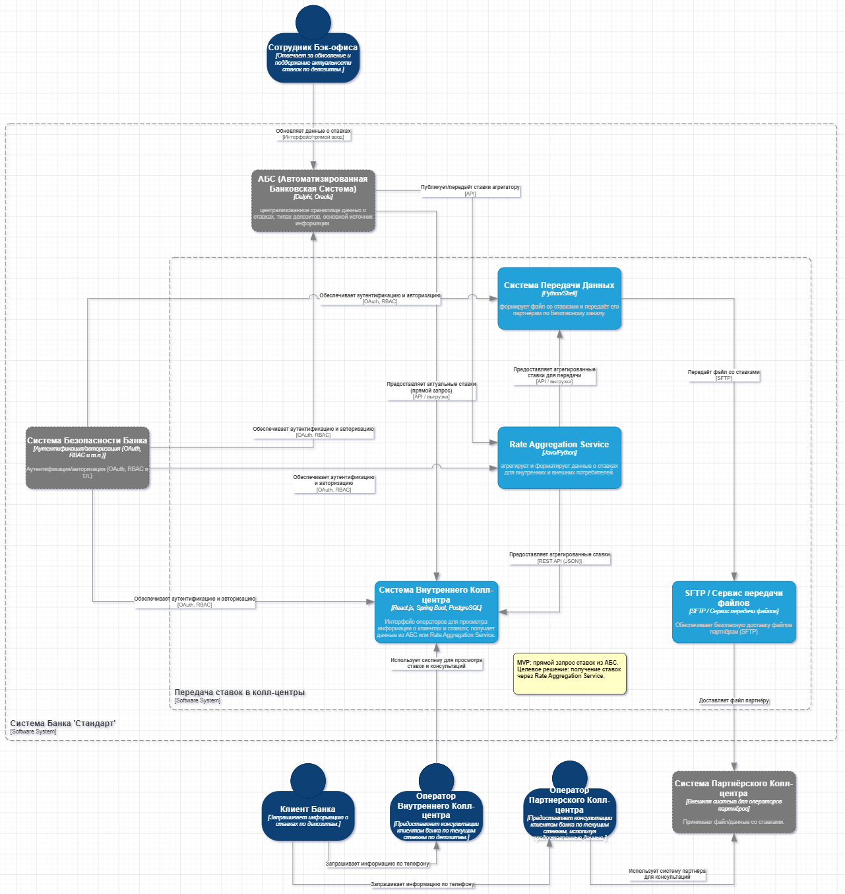
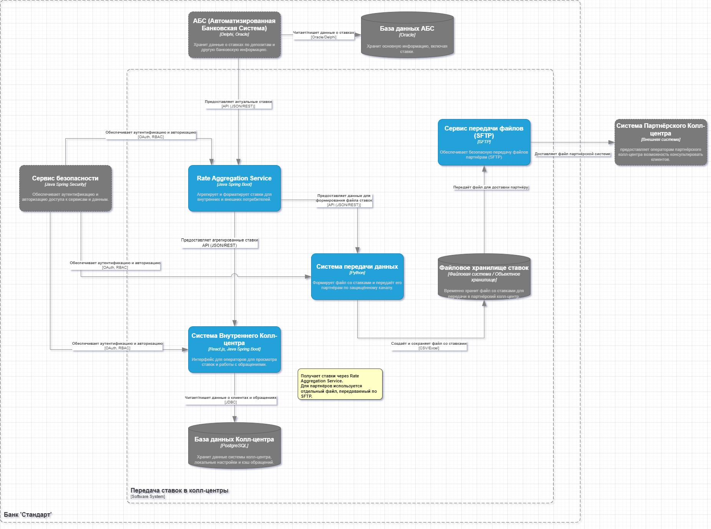

### Название задачи: <a name="_b7urdng99y53">Задание 4. Передача ставок в кол-центр</a>

### Автор: <a name="_hjk0fkfyohdk">Michael Netesunny</a>

### Дата: <a name="_uanumrh8zrui">2025-08-08</a>

### <a name="_3bfxc9a45514">Функциональные требования</a>

#### Контекст  

Банк "Стандарт" планирует запуск маркетинговой кампании по привлечению клиентов на депозитные продукты. В связи с этим ожидается увеличение нагрузки на колл-центр, особенно от клиентов старшего возраста, которым потребуется консультация по условиям открытия депозита. Необходимо обеспечить доступ к актуальным ставкам по депозитам как сотрудникам внутреннего, так и партнерского колл-центров. Партнерский колл-центр имеет ограничение на использование API и требует получения данных в виде файла.  

#### Цели  

•  Обеспечить оперативный доступ к актуальным ставкам по депозитам для операторов внутреннего и партнерского колл-центров.  
•  Минимизировать нагрузку на АБС (Автоматизированную Банковскую Систему).  
•  Обеспечить безопасную передачу данных о ставках.  
•  Использовать существующую экспертизу команды банка.  
•  Учитывать ограничения на использование API для партнерского колл-центра.  

|**№**|**Действующие лица или системы**|**Use Case**|**Описание**|
|:---:	| :--------------------------------------------	| :---------------------------------------------------- | :----------------------------------------------------------------------------------------------------------------------------------------------------------|
|	1	| Сотрудник Бэк-офиса 								| Обновление ставок по депозитам 					| Сотрудник бэк-офиса имеет возможность вносить изменения в действующие ставки по депозитам. 															|
|		| 																	| 																				|   																																																								|
|		| 																	| 																				| •  ID: UC-BO-RATE-001																																																|
|		| 																	| 																				| •  Название: Обновление ставок по депозитам																																					|
|		| 																	| 																				| •  Участник: Сотрудник бэк-офиса (Депозиты)																																						|
|		| 																	| 																				| •  Заинтересованные стороны:																																												|
|		| 																	| 																				|   •  Банк: Оперативное управление процентными ставками.																																|
|		| 																	| 																				|   •  Отдел Маркетинга: Адаптация к рыночной ситуации и конкурентным предложениям.																			|
|		| 																	| 																				|   •  Отдел Комплаенс: Соблюдение внутренних политик и регуляторных требований.																					|
|		| 																	| 																				| •  Предусловия:																																																		|
|		| 																	| 																				|   •  Сотрудник имеет доступ к АБС с соответствующими правами для изменения ставок.																				|
|		| 																	| 																				|   •  У сотрудника есть полномочия на изменение ставок, подтвержденные руководством.																			|
|		| 																	| 																				|   •  Сотрудник прошел обучение по работе с модулем управления ставками в АБС.																						|
|		| 																	| 																				| •  Основной сценарий:																																															|
|		| 																	| 																				|   1. Сотрудник бэк-офиса авторизуется в АБС.																																						|
|		| 																	| 																				|   2. Сотрудник переходит в раздел "Управление депозитными ставками".																										|
|		| 																	| 																				|   3. Система отображает список существующих депозитных продуктов и их текущие ставки.																		|
|		| 																	| 																				|   4. Сотрудник выбирает депозитный продукт, ставку по которому необходимо изменить.																			|
|		| 																	| 																				|   5. Сотрудник вводит новое значение ставки.																																						|
|		| 																	| 																				|   6. Сотрудник вводит причину изменения ставки (например, "изменение ключевой ставки ЦБ", "конкурентное предложение").			|
|		| 																	| 																				|   7. Сотрудник подтверждает изменение ставки.																																					|
|		| 																	| 																				|   8. Система запрашивает подтверждение операции через второй фактор аутентификации (например, SMS-код).									|
|		| 																	| 																				|   9. Сотрудник вводит полученный код.																																								|
|		| 																	| 																				|   10. Система сохраняет новое значение ставки в АБС с указанием даты и времени изменения, а также сотрудника, 								|
|		| 																	| 																				|       внесшего изменение.   																																														|
|		| 																	| 																				|   11. Система уведомляет сотрудника об успешном изменении ставки.																											|
|		| 																	| 																				| •  Альтернативные сценарии:																																													|
|		| 																	| 																				|   •  UC-BO-RATE-001-A: Некорректный формат ставки:																																		|
|		| 																	| 																				|     1. На шаге 5 сотрудник вводит ставку в некорректном формате (например, текст вместо числа, отрицательное значение).					|
|		| 																	| 																				|     2. Система отображает сообщение об ошибке и предлагает исправить формат.																							|
|		| 																	| 																				|   •  UC-BO-RATE-001-B: Превышение лимитов изменения ставки:																														|
|		| 																	| 																				|     1. На шаге 5 сотрудник вводит ставку, превышающую допустимый лимит изменения 																				|
|		| 																	| 																				|        (например, изменение более чем на 2% за один раз).   																																|
|		| 																	| 																				|     2. Система отображает сообщение о превышении лимита и предлагает запросить согласование руководства.										|
|		| 																	| 																				|   •  UC-BO-RATE-001-C: Ошибка второго фактора аутентификации:																													|
|		| 																	| 																				|     1. На шаге 9 сотрудник вводит неверный код второго фактора.																													|
|		| 																	| 																				|     2. Система отображает сообщение об ошибке и предлагает повторить ввод кода. 																					|
|		| 																	| 																				|        (После нескольких неудачных попыток операция отменяется).   																												|
|		| 																	| 																				| •  Постусловия:																																																		|
|		| 																	| 																				|   •  Новое значение ставки сохранено в АБС.																																						|
|		| 																	| 																				|   •  Запись об изменении ставки зафиксирована в журнале аудита.																													|
|		| 																	| 																				|   •  Сотрудник уведомлен об успешном изменении ставки.																																|
|		| 																	| 																				|   																																																								|
|	2	| Система АБС 											| Сохранение ставок по депозитам 						| Система АБС должна хранить актуальные ставки по различным типам депозитов. 																						|
| 	  	| 																	| 																				|   																																																								|
|		| 																	| 																				| •  ID: UC-ABS-RATE-001																																															|
|		| 																	| 																				| •  Название: Сохранение ставок по депозитам																																						|
|		| 																	| 																				| •  Участник: Система АБС (без участия человека)																																					|
|		| 																	| 																				| •  Заинтересованные стороны:																																												|
|		| 																	| 																				|   •  Банк: Обеспечение целостности и доступности данных о ставках.																												|
|		| 																	| 																				|   •  Все системы, использующие данные о ставках (Интернет-Банк, Колл-центр, Система передачи данных).												|
|		| 																	| 																				|   •  Отдел Комплаенс: Соответствие требованиям к хранению данных.																												|
|		| 																	| 																				| •  Предусловия:																																																		|
|		| 																	| 																				|   •  Работающая база данных АБС.																																											|
|		| 																	| 																				|   •  Определена структура хранения ставок по депозитам (таблицы, поля).																										|
|		| 																	| 																				|   •  Настроены механизмы резервного копирования и восстановления данных.																								|
|		| 																	| 																				| •  Основной сценарий:																																															|
|		| 																	| 																				|   1. Система АБС получает запрос на сохранение или обновление ставки по депозиту (от сотрудника бэк-офиса - Use Case 1).				|
|		| 																	| 																				|   2. Система проверяет валидность данных (формат, допустимые значения).																									|
|		| 																	| 																				|   3. Система сохраняет или обновляет данные о ставке в соответствующей таблице базы данных.																|
|		| 																	| 																				|   4. Система создает запись в журнале аудита, содержащую информацию об изменении ставки 																|
|		| 																	| 																				|      (дата, время, пользователь, старое и новое значения).   																																|
|		| 																	| 																				| •  Альтернативные сценарии:																																													|
|		| 																	| 																				|   •  UC-ABS-RATE-001-A: Ошибка записи в базу данных:																																		|
|		| 																	| 																				|     1. На шаге 3 возникает ошибка при записи данных в базу данных (например, нехватка места, сбой диска).											|
|		| 																	| 																				|     2. Система регистрирует ошибку и уведомляет администратора.																													|
|		| 																	| 																				|   •  UC-ABS-RATE-001-B: Нарушение целостности данных:																																	|
|		| 																	| 																				|     1. На шаге 2 система обнаруживает попытку сохранения некорректных данных, которые нарушают целостность базы данных 			|
|		| 																	| 																				|        (например, попытка установить отрицательную ставку).   																															|
|		| 																	| 																				|     2. Система отклоняет сохранение данных и регистрирует ошибку.																												|
|		| 																	| 																				| •  Постусловия:																																																		|
|		| 																	| 																				|   •  Данные о ставке сохранены в базе данных АБС.																																			|
|		| 																	| 																				|   •  Информация об изменении зафиксирована в журнале аудита.																													|
|		| 																	| 																				|   •  (В случае ошибки - администратор уведомлен).																																				|
| 	  	| 																	| 																				|   																																																								|
|	3	| Внутренний колл-центр 							| Получение актуальных ставок по депозитам	| Система внутреннего колл-центра должна получать актуальные ставки по депозитам для предоставления консультаций клиентам.		|
| 	  	| 																	| 																				|   																																																								|
|		| 																	| 																				| •  ID: UC-ICC-RATE-001																																																|
|		| 																	| 																				| •  Название: Получение актуальных ставок по депозитам																																	|
|		| 																	| 																				| •  Участник: Система внутреннего колл-центра (без участия человека)																											|
|		| 																	| 																				| •  Заинтересованные стороны:																																												|
|		| 																	| 																				|   •  Внутренний Колл-центр: Предоставление точной и актуальной информации клиентам.																			|
|		| 																	| 																				|   •  Менеджеры Колл-центра: Обеспечение эффективной работы операторов.																								|
|		| 																	| 																				|   •  IT-отдел: Поддержка интеграции с АБС или системой передачи данных.																									|
|		| 																	| 																				| •  Предусловия:																																																		|
|		| 																	| 																				|   •  Работающая система внутреннего колл-центра.																																			|
|		| 																	| 																				|   •  Настроена интеграция системы колл-центра с АБС (через API или чтение базы данных) или с системой передачи данных.				|
|		| 																	| 																				|   •  Определен механизм получения ставок (периодический опрос, получение уведомлений об изменениях).											|
|		| 																	| 																				| •  Основной сценарий (Интеграция с API):																																							|
|		| 																	| 																				|   1. Система колл-центра отправляет запрос в АБС через API для получения списка актуальных ставок.														|
|		| 																	| 																				|   2. АБС возвращает системе колл-центра список депозитных продуктов и их текущие ставки в формате JSON или XML.							|
|		| 																	| 																				|   3. Система колл-центра обновляет данные о ставках в своей базе данных или кэше.																					|
|		| 																	| 																				|   4. Операторам колл-центра отображаются актуальные ставки в интерфейсе.																								|
|		| 																	| 																				| •  Основной сценарий (Чтение базы данных АБС):																																				|
|		| 																	| 																				|   1. Система колл-центра периодически опрашивает базу данных АБС для получения списка актуальных ставок.										|
|		| 																	| 																				|   2. Система колл-центра сравнивает полученные данные с текущими данными о ставках.																			|
|		| 																	| 																				|   3. Если обнаружены изменения, система колл-центра обновляет данные о ставках в своей базе данных или кэше.								|
|		| 																	| 																				|   4. Операторам колл-центра отображаются актуальные ставки в интерфейсе.																								|
|		| 																	| 																				| •  Основной сценарий (Интеграция с Системой Передачи Данных):																													|
|		| 																	| 																				|   1. Система колл-центра получает уведомление от системы передачи данных о том, что доступны новые ставки.									|
|		| 																	| 																				|   2. Система колл-центра запрашивает новые ставки из системы передачи данных.																						|
|		| 																	| 																				|   3. Система колл-центра обновляет данные о ставках в своей базе данных или кэше.																					|
|		| 																	| 																				|   4. Операторам колл-центра отображаются актуальные ставки в интерфейсе.																								|
|		| 																	| 																				| •  Альтернативные сценарии:																																													|
|		| 																	| 																				|   •  UC-ICC-RATE-001-A: Ошибка при получении данных о ставках:																													|
|		| 																	| 																				|     1. На шаге 2 (любой сценарий) возникает ошибка при получении данных о ставках (например, недоступен API, сбой базы данных).	|
|		| 																	| 																				|     2. Система регистрирует ошибку и отображает операторам предупреждение о возможной неактуальности данных.							|
|		| 																	| 																				|   •  UC-ICC-RATE-001-B: Некорректный формат данных о ставках:																														|
|		| 																	| 																				|     1. На шаге 2 (любой сценарий) получены данные о ставках в некорректном формате.																				|
|		| 																	| 																				|     2. Система регистрирует ошибку и уведомляет администратора.																													|
|		| 																	| 																				|     3. (Операторам отображаются последние известные актуальные данные).																									|
|		| 																	| 																				| •  Постусловия:																																																		|
|		| 																	| 																				|   •  Система колл-центра получила актуальные ставки по депозитам.																												|
|		| 																	| 																				|   •  Операторам колл-центра отображаются актуальные ставки в интерфейсе.																								|
|		| 																	| 																				|   •  (В случае ошибки - администратор уведомлен).																																				|
|		| 																	| 																				|   																																																								|
|	4	| Сотрудник Внутреннего колл-центра 	| Просмотр ставок по депозитам							| Сотрудник внутреннего колл-центра может просмотреть актуальные ставки по депозитам в системе колл-центра. 								|
| 	  	| 																	| 																				|   																																																								|
|		| 																	| 																				| •  ID: UC-ICC-RATE-002																																																|
|		| 																	| 																				| •  Название: Просмотр ставок по депозитам																																						|
|		| 																	| 																				| •  Участник: Сотрудник внутреннего колл-центра																																				|
|		| 																	| 																				| •  Заинтересованные стороны:																																												|
|		| 																	| 																				|   •  Внутренний Колл-центр: Предоставление точной и актуальной информации клиентам.																			|
|		| 																	| 																				|   •  Менеджеры Колл-центра: Обеспечение эффективной работы операторов.																								|
|		| 																	| 																				|   •  Клиенты: Получение достоверной информации о депозитных продуктах.																									|
|		| 																	| 																				| •  Предусловия:																																																		|
|		| 																	| 																				|   •  Сотрудник авторизован в системе внутреннего колл-центра.																														|
|		| 																	| 																				|   •  Система колл-центра получила актуальные ставки по депозитам (UC-ICC-RATE-001).																				|
|		| 																	| 																				|   •  У сотрудника есть необходимые права доступа для просмотра ставок.																										|
|		| 																	| 																				| •  Основной сценарий:																																															|
|		| 																	| 																				|   1. Сотрудник получает звонок от клиента, интересующегося депозитными продуктами.																				|
|		| 																	| 																				|   2. Сотрудник переходит в раздел "Депозитные ставки" в системе колл-центра.																							|
|		| 																	| 																				|   3. Система отображает список доступных депозитных продуктов и их актуальные ставки.																			|
|		| 																	| 																				|   4. Сотрудник предоставляет клиенту информацию о ставках по интересующим его депозитам.																	|
|		| 																	| 																				| •  Альтернативные сценарии:																																													|
|		| 																	| 																				|   •  UC-ICC-RATE-002-A: Данные о ставках недоступны:																																		|
|		| 																	| 																				|     1. На шаге 3 система отображает сообщение о том, что данные о ставках в данный момент недоступны 												|
|		| 																	| 																				|        (например, из-за ошибки интеграции или отсутствия подключения к сети).   																							|
|		| 																	| 																				|     2. Сотрудник сообщает клиенту о временной недоступности информации и предлагает перезвонить позже 										|
|		| 																	| 																				|        или обратиться в отделение банка.   																																								|
|		| 																	| 																				|   •  UC-ICC-RATE-002-B: Необходимая информация отсутствует:																														|
|		| 																	| 																				|     1. На шаге 3 система отображает список депозитных продуктов, но не содержит информацию о конкретном продукте, 					|
|		| 																	| 																				|        интересующем клиента (например, новый продукт, еще не добавленный в систему).																			|
|		| 																	| 																				|     2. Сотрудник сообщает клиенту, что информация о данном продукте отсутствует в системе 																	|
|		| 																	| 																				|        и запрашивает дополнительную информацию у руководства или ответственного отдела.   																	|
|		| 																	| 																				| •  Постусловия:																																																		|
|		| 																	| 																				|   •  Сотрудник предоставил клиенту информацию об актуальных ставках по депозитам (или сообщил о недоступности информации).	|
| 	  	| 																	| 																				|   																																																								|
|	5	| Партнерский колл-центр 						| Получение актуальных ставок по депозитам	| Партнерский колл-центр должен получать актуальные ставки по депозитам для предоставления консультаций клиентам.						|
| 	  	| 																	| 																				|   																																																								|
|		| 																	| 																				| •  ID: UC-PCC-RATE-001																																															|
|		| 																	| 																				| •  Название: Получение актуальных ставок по депозитам																																	|
|		| 																	| 																				| •  Участник: Система партнерского колл-центра (без участия человека на данном этапе)																				|
|		| 																	| 																				| •  Заинтересованные стороны:																																												|
|		| 																	| 																				|   •  Партнерский Колл-центр: Предоставление точной и актуальной информации клиентам.																		|
|		| 																	| 																				|   •  Банк: Обеспечение согласованной информации во всех каналах обслуживания.																						|
|		| 																	| 																				|   •  Клиенты: Получение достоверной информации о депозитных продуктах, независимо от канала обращения.										|
|		| 																	| 																				| •  Предусловия:																																																		|
|		| 																	| 																				|   •  Согласован формат файла со ставками (CSV или Excel) с системой передачи данных.																				|
|		| 																	| 																				|   •  Настроен защищенный канал передачи файла (SFTP или защищенное облачное хранилище).																|
|		| 																	| 																				|   •  Система партнерского колл-центра имеет доступ к согласованному источнику данных.																			|
|		| 																	| 																				| •  Основной сценарий:																																															|
|		| 																	| 																				|   1. Система партнерского колл-центра автоматически (по расписанию или по событию) подключается к источнику данных 				|
|		| 																	| 																				|      (SFTP или защищенное облачное хранилище).   																																			|
|		| 																	| 																				|   2. Система скачивает файл с актуальными ставками.																																		|
|		| 																	| 																				|   3. Система парсит файл и импортирует данные о ставках в свою базу данных или кэш.																				|
|		| 																	| 																				|   4. Система уведомляет администратора об успешном получении и импорте данных.																					|
|		| 																	| 																				| •  Альтернативные сценарии:																																													|
|		| 																	| 																				|   •  UC-PCC-RATE-001-A: Ошибка подключения к источнику данных:																													|
|		| 																	| 																				|     1. На шаге 1 возникает ошибка при подключении к источнику данных (например, неверный логин/пароль, недоступен сервер).		|
|		| 																	| 																				|     2. Система регистрирует ошибку и уведомляет администратора.																													|
|		| 																	| 																				|   •  UC-PCC-RATE-001-B: Файл не найден:																																								|
|		| 																	| 																				|     1. На шаге 2 файл с актуальными ставками не найден в источнике данных.																									|
|		| 																	| 																				|     2. Система регистрирует ошибку и уведомляет администратора.																													|
|		| 																	| 																				|   •  UC-PCC-RATE-001-C: Ошибка парсинга файла:																																				|
|		| 																	| 																				|     1. На шаге 3 возникает ошибка при парсинге файла (например, некорректный формат, поврежден файл).											|
|		| 																	| 																				|     2. Система регистрирует ошибку и уведомляет администратора.																													|
|		| 																	| 																				| •  Постусловия:																																																		|
|		| 																	| 																				|   •  Система партнерского колл-центра получила актуальные ставки по депозитам.																						|
|		| 																	| 																				|   •  Администратор уведомлен об успешном или неуспешном получении данных.																							|
| 	  	| 																	| 																				|   																																																								|
|	6	| Система передачи данных						| Формирование и передача файла ставок			| Система формирует файл с актуальными ставками и передает его в партнерский колл-центр.																		|
| 	  	| 																	| 																				|   																																																								|
|		| 																	| 																				| •  ID: UC-DTD-RATE-001																																															|
|		| 																	| 																				| •  Название: Формирование и передача файла ставок																																		|
|		| 																	| 																				| •  Участник: Система передачи данных (без участия человека)																															|
|		| 																	| 																				| •  Заинтересованные стороны:																																												|
|		| 																	| 																				|   •  Партнерский Колл-центр: Получение актуальной информации о ставках.																									|
|		| 																	| 																				|   •  Банк: Обеспечение своевременной передачи данных партнеру.																													|
|		| 																	| 																				|   •  IT-отдел: Поддержка работы системы передачи данных.																																|
|		| 																	| 																				| •  Предусловия:																																																		|
|		| 																	| 																				|   •  Работающая система передачи данных.																																							|
|		| 																	| 																				|   •  Настроена интеграция с АБС (для получения ставок) (UC-ABS-RATE-001 в будущем).																				|
|		| 																	| 																				|   •  Согласован формат файла со ставками (CSV или Excel) с партнерским колл-центром.																				|
|		| 																	| 																				|   •  Настроен защищенный канал передачи файла (SFTP или защищенное облачное хранилище).																|
|		| 																	| 																				| •  Основной сценарий:																																															|
|		| 																	| 																				|   1. Система передачи данных автоматически (по расписанию или по событию) получает актуальные ставки из АБС.								|
|		| 																	| 																				|   2. Система формирует файл (CSV или Excel) с полученными данными о ставках в согласованном формате.												|
|		| 																	| 																				|   3. Система подключается к источнику данных (SFTP или защищенное облачное хранилище).																	|
|		| 																	| 																				|   4. Система передает файл с актуальными ставками в партнерский колл-центр.																							|
|		| 																	| 																				|   5. Система создает запись в журнале аудита об успешной передаче файла.																									|
|		| 																	| 																				| •  Альтернативные сценарии:																																													|
|		| 																	| 																				|   •  UC-DTD-RATE-001-A: Ошибка при получении ставок из АБС:																														|
|		| 																	| 																				|     1. На шаге 1 возникает ошибка при получении данных о ставках из АБС.																									|
|		| 																	| 																				|     2. Система регистрирует ошибку и уведомляет администратора.																													|
|		| 																	| 																				|     3. (Система может попытаться повторить запрос позже).																																|
|		| 																	| 																				|   •  UC-DTD-RATE-001-B: Ошибка при формировании файла:																																|
|		| 																	| 																				|     1. На шаге 2 возникает ошибка при формировании файла (например, неверный формат данных).															|
|		| 																	| 																				|     2. Система регистрирует ошибку и уведомляет администратора.																													|
|		| 																	| 																				|   •  UC-DTD-RATE-001-C: Ошибка подключения к источнику данных:																												|
|		| 																	| 																				|     1. На шаге 3 возникает ошибка при подключении к источнику данных (например, неверный логин/пароль, недоступен сервер).		|
|		| 																	| 																				|     2. Система регистрирует ошибку и уведомляет администратора.																													|
|		| 																	| 																				| •  Постусловия:																																																		|
|		| 																	| 																				|   •  Файл с актуальными ставками передан в партнерский колл-центр.																												|
|		| 																	| 																				|   •  В журнале аудита зафиксирована запись об успешной передаче файла (или об ошибке).																		|
| 	  	| 																	| 																				|   																																																								|																																																

### <a name="_u8xz25hbrgql">Нефункциональные требования</a>

|**№**|**Требование**																																																																|
|:---:	| :-------------------------------------------------------------------------------------------------------------------------------------------------------------------------------------------------- |
|	1	| Безопасность 													| Данные о ставках должны передаваться по защищенным каналам.																									|
|	2	| Актуальность 													| Информация о ставках должна обновляться в колл-центрах не реже одного раза в сутки.														 	|
|	3	| Надежность 														| Система передачи данных должна быть надежной и отказоустойчивой.																						 	|
|	4	| Производительность 										| Система передачи данных не должна создавать значительную нагрузку на АБС.																		 	|
|	5	| Масштабируемость 										| Решение должно быть масштабируемым для обработки возросшего объема данных и количества обращений.					 	|
|	6	| Простота 															| Решение должно быть простым в поддержке и эксплуатации.																										 	|
|	7	| Соответствие регуляторным требованиям	| Решение должно соответствовать всем требованиям регуляторов в отношении защиты информации и обработки данных.	|
|	8	| Согласованность данных								| Данные о ставках должны быть согласованы между АБС, внутренним и партнерским колл-центрами.										|

### <a name="_qmphm5d6rvi3">Решение</a>

#### Диаграмма контекста (Context Diagram):  

Ссылка на схему Drawio: [Передача ставок в колл-центр, банк "Стандарт" (Контекстная диаграмма C4)](ADR_C4_Context.drawio)

#### Описание диаграммы контекста:  

Данная диаграмма контекста отображает взаимодействие между различными персонами (акторами) и системами, вовлеченными в процесс передачи ставок по депозитам в колл-центры банка "Стандарт". Диаграмма показывает границы системы банка и взаимодействие с внешними системами.

**Персоны (Акторы):**  
  **Сотрудник Бэк-офиса:** Отвечает за обновление и поддержание актуальности ставок по депозитам в АБС.  
  **Оператор Внутреннего Колл-центра:** Предоставляет консультации клиентам банка по текущим ставкам по депозитам, используя внутреннюю систему колл-центра.  
  **Оператор Партнерского Колл-центра:** Предоставляет консультации клиентам банка по текущим ставкам по депозитам, используя предоставленные данные (файл).  
  **Клиент Банка:** Запрашивает информацию о ставках по депозитам по телефону.  

**Системы:**  
  **АБС (Автоматизированная Банковская Система):** Централизованное хранилище данных о ставках, типах депозитов, и основной источник информации.  
  **Система Внутреннего Колл-центра:** Предоставляет операторам интерфейс для просмотра информации о клиентах и ставках. Получает данные из АБС (в MVP) или Rate Aggregation Service (в целевом решении).  
  **Rate Aggregation Service:** Агрегирует и форматирует данные о ставках для предоставления во внутренний колл-центр и систему передачи данных (будущее решение).  
  **Система Передачи Данных:** Формирует файл со ставками и передает его в партнерский колл-центр. Использует безопасные каналы передачи.  
  **Система Партнерского Колл-центра:** Внешняя система, используемая операторами партнерского колл-центра для предоставления консультаций клиентам.  

**Внешние Системы:**  
  **Система Безопасности Банка:** Обеспечивает аутентификацию и авторизацию доступа к данным всех систем.  
  **Сервис Передачи Файлов (SFTP):** Обеспечивает безопасную передачу файла ставок в партнерский колл-центр.  

**Связи (Взаимодействия):**  
  **Сотрудник бэк-офиса:** обновляет данные о ставках в АБС.  
  **Операторы внутреннего и партнерского колл-центров:** используют свои системы для предоставления консультаций клиентам.  
  **Клиенты:** запрашивают информацию о ставках у операторов колл-центров.  
  **АБС:** предоставляет актуальные ставки в систему внутреннего колл-центра (в MVP - прямой запрос, в целевом решении - через Rate Aggregation Service).  
  **Rate Aggregation Service:** получает ставки из АБС и предоставляет их в систему внутреннего колл-центра и систему передачи данных.  
  **Система передачи данных:** использует сервис передачи файлов (SFTP) для безопасной передачи файла ставок в партнерский колл-центр.  
  **Система безопасности банка:** обеспечивает аутентификацию и авторизацию для доступа ко всем системам.  

**Соответствие Use Cases и требованиям:**  
  **Use Case: Обновление ставок по депозитам:** отражено связью между сотрудником бэк-офиса и АБС.  
  **Use Case: Сохранение ставок по депозитам:** подчеркивается роль АБС как основного хранилища данных о ставках.  
  **Use Case: Получение актуальных ставок по депозитам (внутренний и партнерский колл-центры):** отражено связями между АБС/Rate Aggregation Service и системами колл-центров.  
  **Use Case: Просмотр ставок по депозитам:** отражено связями между операторами колл-центров и своими системами.  

Диаграмма также показывает, что для внутреннего колл-центра есть два варианта получения данных: прямой запрос к АБС (MVP) и через Rate Aggregation Service (целевое решение). Rate Aggregation Service предполагается создать для уменьшения нагрузки на АБС, повышения гибкости и предоставления данных в удобном формате. Дополнительно указано использование системы безопасности для доступа к данным и файлового сервиса для безопасной передачи данных.  

#### Диаграмма контейнеров (Container Diagram):  

Ссылка на схему Drawio: [Передача ставок в кол-центр, банк "Стандарт" (Контейнерная диаграмма C4)](ADR_C4_Container.drawio)  

#### Описание диаграммы контейнеров:

Данная диаграмма контейнеров отображает внутреннюю структуру системы передачи ставок в колл-центры банка "Стандарт", детализируя основные компоненты и их взаимодействие.  

**Системы (Контейнеры):**  
  **АБС (Автоматизированная Банковская Система):** Основная банковская система, которая хранит данные о ставках по депозитам.  
  **База данных АБС:** Хранит данные, используемые в АБС, в том числе и информацию о ставках.  
  **Rate Aggregation Service:** Сервис, который агрегирует данные о ставках из АБС и предоставляет их в удобном формате для других систем.  
  **Система Внутреннего Колл-центра:** Приложение, которое предоставляет операторам внутреннего колл-центра интерфейс для консультаций.  
  **База данных Колл-центра:** Хранит данные системы колл-центра, включая информацию о клиентах и обращениях.  
  **Система Передачи Данных:** Формирует файл со ставками и передает его в партнерский колл-центр.  
  **Файловое хранилище ставок:** Временно хранит файл со ставками для передачи в партнерский колл-центр.  
  **Сервис Безопасности:** Обеспечивает аутентификацию и авторизацию доступа к данным и сервисам.  

**Внешние Системы:**  
  **Система Партнерского Колл-центра:** Внешняя система, используемая операторами партнерского колл-центра для предоставления консультаций.  
  **Сервис Передачи Файлов (SFTP):** Обеспечивает безопасную передачу файла ставок в партнерский колл-центр.  

**Связи (Взаимодействия):**  
  **АБС:** предоставляет данные о ставках в Rate Aggregation Service через API.  
  **Rate Aggregation Service:** получает данные о ставках из АБС и предоставляет их в систему внутреннего колл-центра и систему передачи данных.  
  **Система внутреннего колл-центра:** читает данные о клиентах и обращениях из своей базы данных.  
  **Система передачи данных:** создает и сохраняет файл со ставками во временном хранилище.  
  **Файловое хранилище ставок:** передает файл ставок в сервис передачи файлов для отправки в партнерский колл-центр.  
  **Сервис передачи файлов:** обеспечивает безопасную передачу файла ставок в партнерский колл-центр.  
  **Сервис безопасности:** обеспечивает аутентификацию и авторизацию для доступа ко всем сервисам и данным.  

**Соответствие с Контекстной Диаграммой:**  
Данная контейнерная диаграмма детализирует систему, описанную в контекстной диаграмме. Она показывает, как компоненты системы взаимодействуют между собой для достижения цели - предоставления актуальных данных о ставках в колл-центры. В частности, она показывает, как будет реализована передача данных в партнерский колл-центр через Rate Aggregation Service, систему передачи данных и файловое хранилище и SFTP. Использование Rate Aggregation Service позволяет абстрагироваться от прямого доступа к данным АБС, как указано в контекстной диаграмме (целевое решение).  

**Обоснование выбора технологий:**  

  **Java Spring Boot:** Выбор Java Spring Boot для системы передачи данных обусловлен экспертизой команды АБС в Java-стеке, что упростит разработку и поддержку.  
  **CSV/Excel:** Выбор формата файла для партнерского колл-центра обусловлен ограничением на использование API и требованием получения данных в виде файла. Необходимо уточнить, какой из форматов (CSV или Excel) предпочтительнее для партнерского колл-центра.  
  **SFTP/Защищенное облачное хранилище:** Выбор канала передачи данных обусловлен требованием безопасности. Необходимо согласовать с партнерским колл-центром наиболее подходящий и безопасный вариант.  

### <a name="_bjrr7veeh80c">Альтернативы</a>

#### Наиболее важные альтернативные решения.  

1. **Прямой доступ системы внутреннего колл-центра к базе данных АБС (только для MVP):** Проще для MVP, но создает зависимость и риски; рекомендуется разработка API и использование Rate Aggregation Service в долгосрочной перспективе.  
2. **Разработка API для партнерского колл-центра:** Невозможно из-за ограничений партнерского колл-центра.  
3. **Ручной ввод данных в системы колл-центров:** Неприемлем из-за высокой вероятности ошибок и неэффективности.  

#### Недостатки, ограничения, риски  

- **Необходимость разработки Rate Aggregation Service:** Требует дополнительных затрат времени и ресурсов.  
- **Формат файла для партнерского колл-центра (CSV/Excel):** Менее надежный, чем API, и сложнее в поддержке; требуется четкая документация и обеспечение стабильности формата.  
- **Ручная загрузка файла в систему партнерского колл-центра:** Зависимость от действий сотрудников партнерского колл-центра может приводить к задержкам и ошибкам; необходимо обеспечить четкие инструкции и обучение.  
- **Нагрузка на АБС:** Необходим мониторинг производительности АБС и оптимизация запросов после внедрения Rate Aggregation Service.  
- **Безопасность передачи данных:** Использовать только защищенные каналы связи (SFTP, защищенное облачное хранилище).  
- **Изменения в структуре данных АБС:** Необходимо тесное взаимодействие между командами разработки и своевременное уведомление об изменениях для обеспечения согласованности.  

Реализация данного решения обеспечит оперативный доступ к актуальным ставкам по депозитам для операторов внутреннего и партнерского колл-центров, минимизируя нагрузку на АБС и обеспечивая безопасную передачу данных. Необходимо тщательно протестировать и задокументировать все компоненты системы.  
