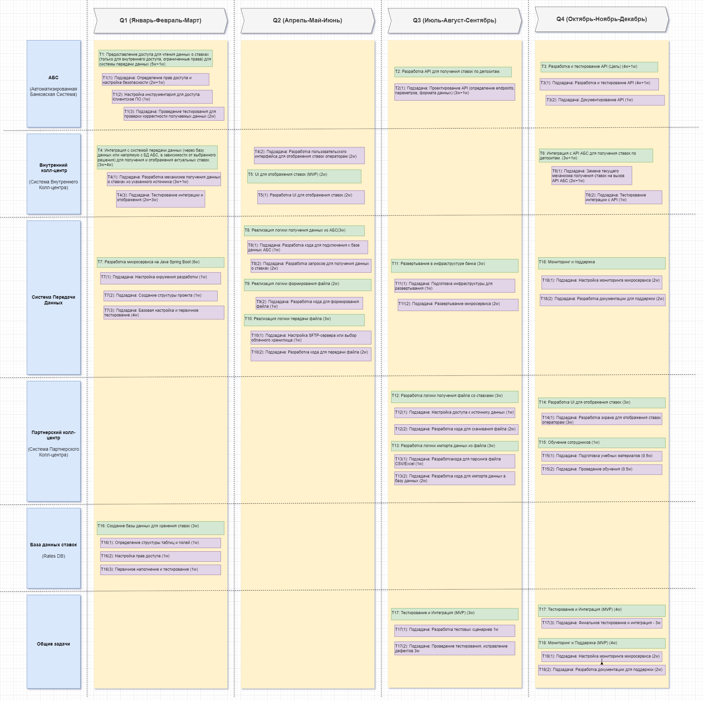

## Задание 4. Передача ставок в кол-центр

### Roadmap, Передача ставок в кол-центр

Ссылка на схему Drawio: [Roadmap, Передача ставок в кол-центр, банк "Стандарт"](Roadmap.drawio)

### Список задач и подзадач по системам/посистемам, по кварталам, и порядком следования задач:

1) **АБС (Автоматизированная Банковская Система)**
- T1: Предоставление доступа для чтения данных (MVP)  
  - Квартал: Q1 (Янв–Март)  
  - Длительность: в начале Q1 (основная задача выполнена в Q1)  
  - Подзадачи:  
    - Определение прав доступа и настройка безопасности — внутри T1 (в Q1)  
    - Настройка инструментария для доступа. Клиентское ПО (в т.ч. драйвера для доступа к базе данных АБС) — внутри T1 (в Q1)  
    - Тестирование корректности данных — внутри T1 (в Q1)  
  - Последовательность: стартовая задача для доступа к данным — должна быть выполнена до всех задач, которые читают данные из АБС (в частности — перед T8, T3/T6, если требуется доступ).

- T2: Проектирование API (Цель)  
  - Квартал: Q3–Q4 (Июль–Дек)  
  - Длительность: начало в Q3 и продолжение/завершение в Q4  
  - Подзадачи:  
    - Определение endpoints, параметров, формата данных — внутри T2 (в Q3–Q4)  
  - Последовательность: выполняется до разработки API (T3) и до интеграции с внешними потребителями (T6).

- T3: Разработка и тестирование API (Цель)  
  - Квартал: Q4 (Окт–Дек)  
  - Длительность: весь Q4 (основная разработка/тестирование и документация выполняются в Q4)  
  - Подзадачи:  
    - Разработка и тестирование API — внутри T3 (в Q4)  
    - Документирование API — внутри T3 (в Q4)  
  - Последовательность: следует за T2 (проектирование API) и за T1 (если API использует доступы/данные из АБС).

2) **Внутренний Колл-центр**
- T4: Интеграция с системой передачи данных (MVP)  
  - Квартал: Q1–Q2 (Янв–Июнь)  
  - Длительность: старт в Q1, продолжается в Q2  
  - Подзадачи:  
    - Разработка механизма получения данных о ставках — внутри T4 (в Q1–Q2)  
  - Последовательность: стартует параллельно с T1/T7; необходима до отображения ставок операторам (T5) и до полной замены на API (T6).

- T5: UI для отображения ставок (MVP)  
  - Квартал: Q2 (Апр–Июнь)  
  - Длительность: основной объём в Q2  
  - Подзадачи:  
    - Разработка UI для отображения ставок операторам — внутри T5 (в Q2)  
  - Последовательность: выполняется после / параллельно с T4 (когда механизм получения данных готов).

- T6: Интеграция с API АБС (Цель)  
  - Квартал: Q4 (Окт–Дек)  
  - Длительность: весь Q4 (замена механизма и тест интеграции)  
  - Подзадачи:  
    - Замена текущего механизма получения ставок на API — внутри T6 (в Q4)  
    - Тестирование интеграции с API — внутри T6 (в Q4)  
  - Последовательность: выполняется после T3 (реализация API) и после T11 (если требуется готовая инфраструктура/деплой).

3) **Система Передачи Данных**
- T7: Разработка микросервиса (MVP)  
  - Квартал: Q1 (Янв–Март)  
  - Длительность: весь Q1 (инициация и создание структуры)  
  - Подзадачи:  
    - Настройка окружения разработки — внутри T7 (в Q1)  
    - Создание структуры проекта — внутри T7 (в Q1)  
  - Последовательность: стартовая для всей системы передачи данных — необходим перед T8–T11.

- T8: Логика получения данных из АБС (MVP)  
  - Квартал: Q2 (Апр–Июнь)  
  - Длительность: основной объём в Q2  
  - Подзадачи:  
    - Код для подключения к БД АБС — внутри T8 (в Q2)  
    - Запросы для получения данных о ставках — внутри T8 (в Q2)  
  - Последовательность: выполняется после T7; обеспечивает данные для T9/T10.

- T9: Формирование файла (CSV/Excel) (MVP)  
  - Квартал: Q2 (Апр–Июнь)  
  - Длительность: основной объём в Q2  
  - Подзадачи:  
    - Выбор библиотеки для формирования файлов — внутри T9 (в Q2)  
    - Код для формирования файла — внутри T9 (в Q2)  
  - Последовательность: следует за T8 (получение данных).

- T10: Передача файла в партнерский колл-центр (MVP)  
  - Квартал: Q2 (Апр–Июнь)  
  - Длительность: основной объём в Q2  
  - Подзадачи:  
    - Настройка SFTP/облачного хранилища — внутри T10 (в Q2)  
    - Код для передачи файла — внутри T10 (в Q2)  
  - Последовательность: выполняется после T9 (файл сформирован) и перед T12 (получение файла партнёром).

- T11: Развертывание в инфраструктуре банка (MVP)  
  - Квартал: Q3 (Июль–Сент)  
  - Длительность: основной объём в Q3  
  - Подзадачи:  
    - Подготовка инфраструктуры для развертывания — внутри T11 (в Q3)  
    - Развертывание микросервиса — внутри T11 (в Q3)  
  - Последовательность: выполняется после T7–T10 (когда микросервис и передача файлов готовы); необходим перед массовым использованием/интеграцией (T6, T17).

4) **Партнерский Колл-центр**
- T12: Получение файла со ставками (MVP)  
  - Квартал: Q3 (Июль–Сент)  
  - Длительность: основной объём в Q3  
  - Подзадачи:  
    - Настройка доступа к источнику данных — внутри T12 (в Q3)  
    - Разработка кода для скачивания файла — внутри T12 (в Q3)  
  - Последовательность: выполняется после T10 (передача файла); результат T12 нужен для последующего импорта (T13).

5) **Импорт, UI, обучение, БД и общие задачи (вторая часть)**
- T13: Импорт данных из файла (MVP)  
  - Квартал: Q3 (Июль–Сент)  
  - Длительность: основной объём в Q3  
  - Подзадачи:  
    - Разработка кода для парсинга файла — внутри T13 (в Q3)  
    - Код для импорта данных в базу данных — внутри T13 (в Q3)  
  - Последовательность: следует за T12 (партнёр скачал файл) и за T16 (если база должна быть готова до импорта).

- T14: UI для отображения ставок (MVP)  
  - Квартал: Q4 (Окт–Дек)  
  - Длительность: основной объём в Q4  
  - Подзадачи:  
    - Разработка экрана для отображения ставок — внутри T14 (в Q4)  
  - Последовательность: выполняется после T13 (импорт) и после T11/T16 (если данные хранятся в Rates DB).

- T15: Обучение сотрудников (MVP)  
  - Квартал: Q4 (Окт–Дек)  
  - Длительность: короткая активность в Q4 (подготовка материалов и проведение обучения)  
  - Подзадачи:  
    - Подготовка учебных материалов — внутри T15 (в Q4)  
    - Проведение обучения — внутри T15 (в Q4)  
  - Последовательность: проводится после готовности UI и процессов (T14, T17) для пользователей.

- T16: Создание базы данных для хранения ставок (Rates DB) (MVP)  
  - Квартал: Q1 (Янв–Март)  
  - Длительность: основной объём в Q1 (проектирование и первичная настройка)  
  - Подзадачи:  
    - Определение структуры таблиц и полей — внутри T16 (в Q1)  
    - Настройка прав доступа — внутри T16 (в Q1)  
  - Последовательность: рекомендуется выполнить ранним этапом (Q1) до импорта данных (T13) и до интеграций, которые будут записывать/читать ставки.

- T17: Тестирование и Интеграция (MVP)  
  - Квартал: Q3–Q4 (Июль–Дек)  
  - Длительность: длительная активность в Q3 и Q4 (сквозное тестирование, исправления)  
  - Подзадачи:  
    - Разработка тестовых сценариев, проведение тестирования, исправление дефектов — внутри T17 (Q3–Q4)  
  - Последовательность: проводится после основных разработок (T3, T6, T11, T13, T14) и параллельно с финальными интеграциями; итоговое условие перед запуском/обучением.

- T18: Мониторинг и Поддержка (MVP)  
  - Квартал: Q4 (Окт–Дек)  
  - Длительность: основной объём в Q4 (настройка мониторинга и документации)  
  - Подзадачи:  
    - Настройка мониторинга — внутри T18 (в Q4)  
    - Разработка документации для поддержки — внутри T18 (в Q4)  
  - Последовательность: выполняется после развертывания и тестирования (T11, T17) и параллельно с обучением (T15).

#### Ключевые зависимости и порядок (сводно)
- Ранние базовые элементы: T1 (доступ к данным) и T16 (Rates DB) — желательно завершить первыми (Q1). T7 (микросервис) тоже стартует в Q1.
- После подготовки инфраструктуры/микросервиса: T8 → T9 → T10 (Q2) — формирование и передача файлов; затем T12 (получение у партнёра) и T13 (парсинг/импорт) в Q3.
- Параллельно: внутренний UI (T5) в Q2 опирается на T4; развёртывание в инфрастуктуре (T11) в Q3 готовит среду для интеграций.
- Проектирование API (T2) в Q3–Q4 → разработка API (T3) в Q4 → интеграция AБС через API (T6) в Q4.
- Финальная стадия: сквозное тестирование и интеграция (T17) в Q3–Q4, затем мониторинг и поддержка (T18) и обучение сотрудников (T15) в Q4, а также финальный UI (T14) в Q4.

### Список задач и подзадач по системам/посистемам, по кварталам с длительностью выполнения для каждой задачи и подзадачи:

1. **АБС (Автоматизированная Банковская Система):**  

   - **T1:** Предоставление доступа (MVP) — Q1: 5w+4w  
     - **T1(1):** Определение прав доступа и настройка безопасности - 2w + 1w  
     - **T1(2):** Настройка инструментария для доступа. Клиентское ПО (в т.ч. драйвера для доступа к базе данных АБС) - 1w  
     - **T1(3):** Проведение тестирования для проверки корректности получаемых данных - 2w  

   - **T2:** Проектирование API (Цель) — Q3: 3w+1w  
     - **T2(1):** Проектирование API (определение endpoints, параметров, формата данных) - 3w+1w  

   - **T3:** Разработка и тестирование API (Цель) — Q4: 4w+1w  
     - **T3(1):** Разработка и тестирование API - 4w+1w  
     - **T3(2):** Документирование API - 1w  

2. **Внутренний Колл-центр:**  

   - **T4:** Интеграция с Системой передачи (MVP) — Q1: 3w+4w  
     - **T4(1):** Разработка механизма получения данных о ставках из указанного источника - 3w+1w  
     - **T4(2):** Разработка пользовательского интерфейса для отображения ставок операторам - 2w  
     - **T4(3):** Тестирование интеграции и отображения - 2w+3w  

   - **T5:** UI для отображения ставок (MVP) — Q2: 2w  
     - **T5(1):** Разработка UI для отображения ставок - 2w  
   
   - **T6:** Интеграция с API АБС (Цель) — Q4: 3w+1w  
     - **T6(1):** Замена текущего механизма получения ставок на вызов API АБС - 2w+1w  
     - **T6(2):** Тестирование интеграции с API - 1w  

3. **Система Передачи Данных:**  

   - **T7:** Разработка микросервиса (MVP) — Q1: 6w  
     - **T7(1):** Настройка окружения разработки - 1w  
     - **T7(2):** Создание структуры проекта - 1w  
     - **T7(3):** Базовая настройка и первичное тестирование - 4w  
  
   - **T8:** Логика получения ставок (MVP) — Q2: 3w  
     - **T8(1):** Разработка кода для подключения к базе данных АБС - 1w  
     - **T8(2):** Разработка запросов для получения данных о ставках - 2w  
  
   - **T9:** Формирование файла (MVP) — Q2: 2w  
     - **T9(1):** Выбор библиотеки для формирования файлов CSV/Excel - 1w  
     - **T9(2):** Разработка кода для формирования файла - 1w  
  
   - **T10:** Передача файла (MVP) — Q2: 3w  
     - **T10(1):** Настройка SFTP-сервера или выбор защищенного облачного хранилища - 1w  
     - **T10(2):** Разработка кода для передачи файла - 2w  
  
   - **T11:** Развертывание (MVP) — Q3: 3w  
     - **T11(1):** Подготовка инфраструктуры для развертывания микросервиса - 1w  
     - **T11(2):** Развертывание микросервиса - 2w  
	 
4. **Партнерский Колл-центр:**  

   - **T12:** Получение файла (MVP) — Q3: 3w  
     - **T12(1):** Настройка доступа к источнику данных - 1w  
     - **T12(2):** Разработка кода для скачивания файла - 2w  
  
   - **T13:** Импорт данных (MVP) — Q3: 3w  
     - **T13(1):** Разработка кода для парсинга файла CSV/Excel - 1w  
     - **T13(2):** Разработка кода для импорта данных в базу данных - 2w  
  
   - **T14:** UI для отображения ставок (MVP) — Q4: 3w  
     - **T14(1):** Разработка экрана для отображения ставок операторам - 3w  
   
   - **T15:** Обучение (MVP) — Q4: 1w  
     - **T15(1):** Подготовка учебных материалов - 0.5w  
     - **T15(2):** Проведение обучения - 0.5w  

5. **База данных ставок (Rates DB, новый компонент):**  

   - **T16:** Создание БД ставок (MVP) — Q1: 3w  
     - **T16(1):** Определение структуры таблиц и полей - 1w  
     - **T16(2):** Настройка прав доступа - 1w  
     - **T16(3):** Первичное наполнение и тестирование - 1w  

6. **Общие задачи:**  

   - **T17:** Тестирование и Интеграция (MVP) — Q3: 3w; Q4: 4w  
     - **T17(1):** Разработка тестовых сценариев - 1w  
     - **T17(2):** Проведение тестирования, исправление дефектов - 3w  
     - **T17(3):** Финальное тестирование и интеграция - 3w  

   - **T18:** Мониторинг и Поддержка (MVP) — Q4: 4w  
     - **T18(1):** Настройка мониторинга микросервиса - 2w  
     - **T18(2):** Разработка документации для поддержки - 2w  

#### Пояснения:

- **Q1:** Первый квартал года (Январь, Февраль, Март)  
- **Q2:** Второй квартал года (Апрель, Май, Июнь)  
- **Q3:** Третий квартал года (Июль, Август, Сентябрь)  
- **Q4:** Четвертый квартал года (Октябрь, Ноябрь, Декабрь)  

**Пример обозначения длительности выполнения:**  
5w+4w означает: 5 недель активной/интенсивной работы и ещё 4 недели продолжения/стабилизации/буфера.  
Итого задача занимает 9 недель (~2.25 месяца). В таблице T1 размещена в Q1, то есть все 9 недель попадают в первый квартал.  

### Общие обозначения, соглашения и пояснения:

- **MVP (Minimum Viable Product):** Задачи, необходимые для реализации минимально жизнеспособного продукта в течение первых 6 месяцев.  
- **Целевое решение:** Задачи, направленные на улучшение и оптимизацию системы в течение 12 месяцев.  
- **Сроки задач** могут быть скорректированы в зависимости от приоритетов и ресурсов.  
- В столбце **"Общие задачи"** указаны задачи, которые выполняются параллельно с другими задачами.  
- **Длительность задач** обозначена примерным количеством недель **w**.  
